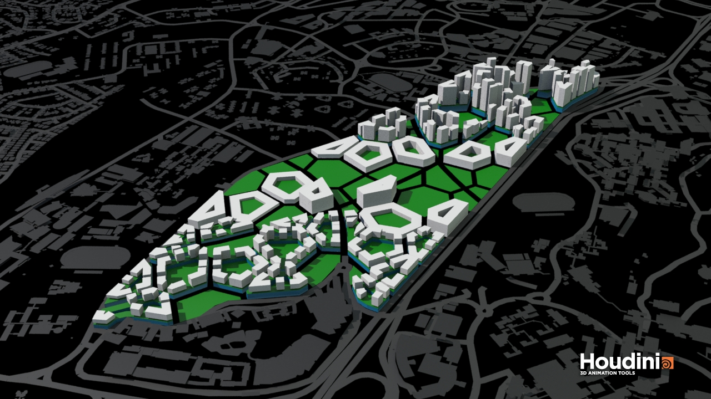
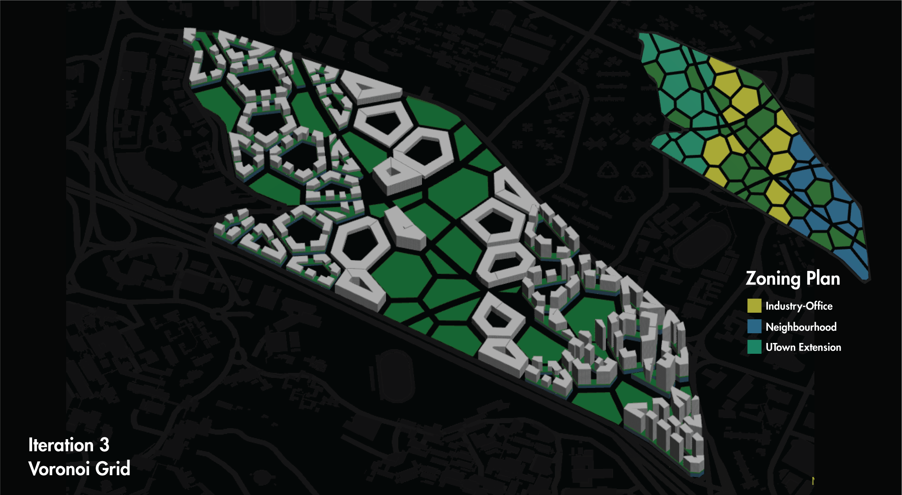

# POLYGON

The first algorithm seeks to simulate a traditional planning process where zones and road networks are planned first and then followed by zoning and typology constrains. It introduces a courtyard-podium typology for high density mixed-used living. 

The algorithm is generated in the following steps:

The main circulation to the existing network is carved out from the site. A simple 3 road system connects the site to the surrounding neighborhood and districts.

The resulting plots of land are divided further into a grid of 120m x 120m. These would be the basic urban block of the city. The size is inspired from the grid size of Barcelona which is highly walkable. 

The parcels are offset 5m from each other, creating 10m wide secondary roads. The maximum distance to a main road from any of the parcels is shorter than 200m. This is a highly walkable distance. That would allow residents to traverse through the city either on foot or vehicle conveniently.

Next, the distance to UTown and one-north MRT calculated previously are used as attractor factors to determine the zones.

   * If distance to Utown < 150m, plot alloted as Utown Extension
   * If distance to one-north < 400m, plot alloted as residential neighborhood
   * The leftover plots alloted to high tech industry.

To ensure a vibrant life, we are proposing a courtyard-podium + tower typology. This is a high density mixed-use typology with commercial and education at the podium and residential in the towers. It is expected to have a high passive ratio and acceptable good window ratio.

The plot is firstly offset from the center with a width of 20m. Next, the podium is extruded according to relative density and the roof is further divided into plots for towers. Each tower is offset 8 meters from each other (16m distance from blocks) to facilitate wind flow through the building and increase view factor. The towers are then raised 5m up to create a porous roof level as a private open space for residents.

Performance analysis of this typology has returned good results. However, one tower scored low on solar exposure. This is due to a large facade facing the east. This would not be a problem if we consider all the towers as an one building as the ratios would be averaged out by the north-south facades of other towers. Therefore, in order to give a balanced overall assesment, we've decided to reduce the solar exposure threashold to 0.25 (easier) and increase the view factor to 0.45 (harder) so as to adapt the thresholds to this specific typology. The rest of the parameters remains unchanged.

After populating the plots with the typology, performance analysis has returned a good building percentage of 81% . We see that some buildings are classified as “bad” due to limited view. Therefore, the following improvements are proposed:

   *   A curved main road. (Variety in building orientation)
   *   Wider secondary roads (10m to 16m, better view, wider pedestrain path)
   *   Wider Factories (20m to 30m) to leverage on high passive ratio
   *   Convert 20% of plots to open spaces
   *   Towers vary in height for better view 

With the above improvements, good building percentage has increased to 87.2%. However, the urban fabric still looks too rigid and dense spatially.

To improve further, the rectangular grid could be changed to a Voronoi grid. A Voronoi grid creates more turns and multi-edged urban blocks which offers higher excitement in walking and more dynamism in views.

With Voronoi, good building ratio has improved further to 90%. It also helps to slow down traffic and increase walkability in the neighbourhoods. Traffic in and out of the city could still take the main roads and trickle down to each urban plot. 

The podium typology creates a good mix between retail and residential and all factory and offices are within walking distance from both UTown and one-north.
