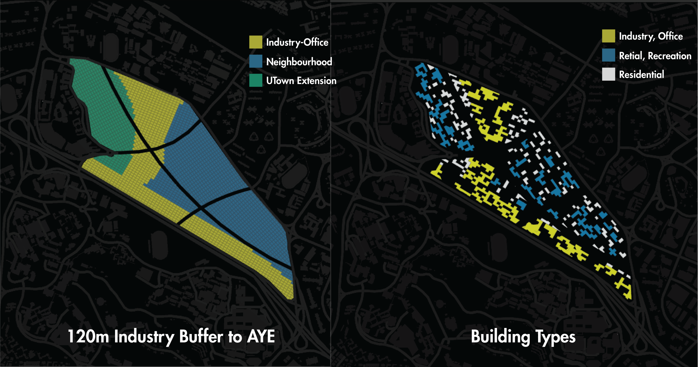
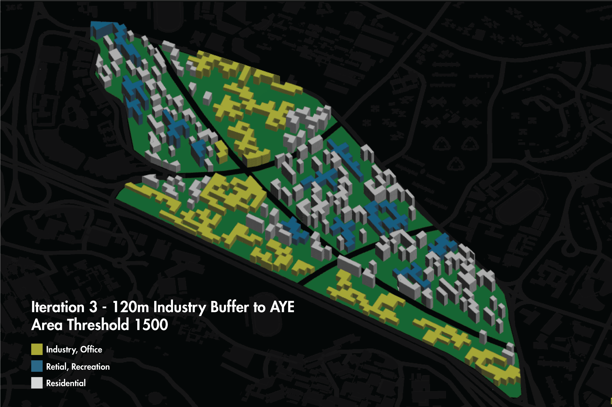
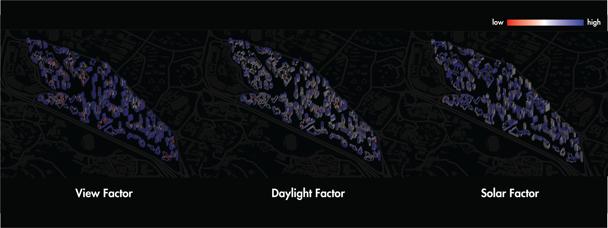
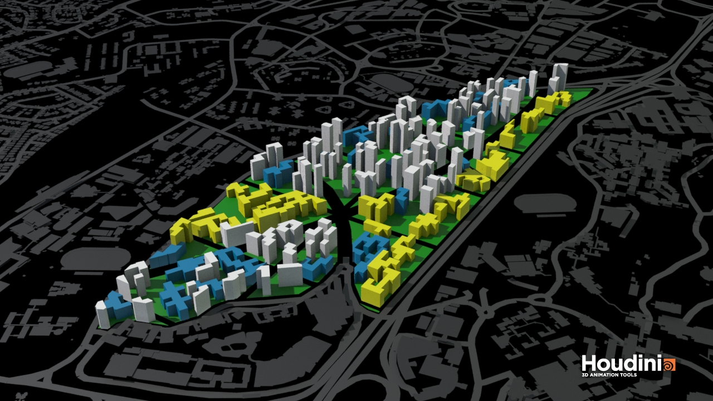

# TETRIS

The second algorithm seeks to find an alternative way to generate a livable city. Instead of generating building plots, the building footprints are generated by shuffling and rearranging from a huge grid of small plots. This creates a more dynamic skyline and simulates an actual process of city growth where buildings might take on different shapes and heights.

The algorithm is constructed in the following steps:

A 20mx15m grid is applied onto the site. This size allows for flexible addition and returns good passive ratio.

1 out of 4 plots are allocated as building plots. The rest would become green public space. 

The resulting plot sizes varies according to block adjacency. A split function is applied to separate plots that are larger than a certain area. The large and continuous plots are allocated as Industrial or Commercial while the smaller plots are allocated as Residential. We have chosen the area threshold of 1500 for a good mix of programs.

The first massing shows a dynamic urban fabric with good analysis results. Under default analysis threshold, the percentage of good buildings is more than 93% which is better than the final outcome of POLYGON.

The next step defines zones with attractor factors such as distance to UTown and distance to one-north. The outcome has a spatial hierachy where residents can conveniently access retail services and collaborate with students in the industrial zone. 

Due to the flexibility of this algorithm, we decided to add distance to AYE as another attractor to demarcate 120m factory zone as buffer to the noise produced by the expressway. The resulting cityscape shows a good mixture of different programs. 

Next, we address the elephant in the room. Although the buildings have sufficient green spaces between them, they do not have a predetermined secondary road network. This would create traffic havocs in real situations. Therefore, the site is divided by superblocks of 300mx350m which adds a secondary artery to the main roads. Furtheurmore, the area threshold is reduced to 1200 to convert more buildings into commercial for a better mix of programs within each superblock.

Performance analysis of the final iteration has returned outstanding results. More than 95% of the buildings are classified as “good” with 100% satisfying the threshold for good passive ratio. Window analysis shows that the “red” buildings are just a little short in daylight and solar factor. This discrepancy could be tackled by building envelope design, and we can conclude that this algorithm is able to create urban fabrics that are both high performing and livable.

