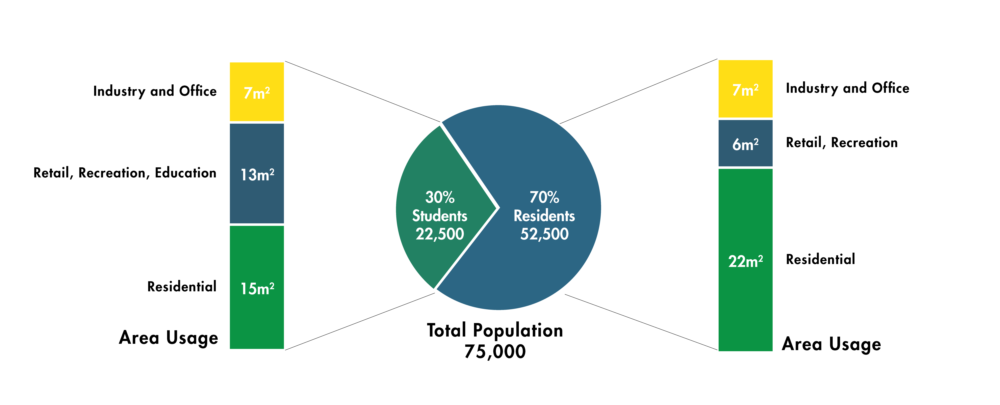
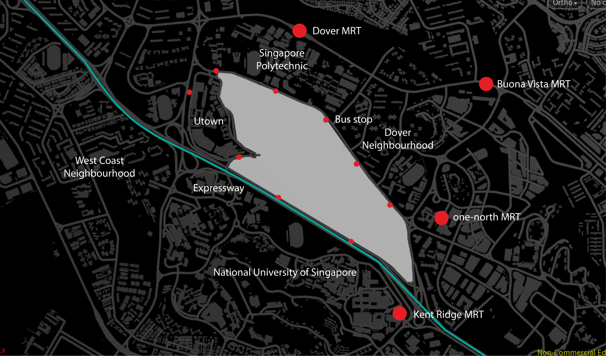
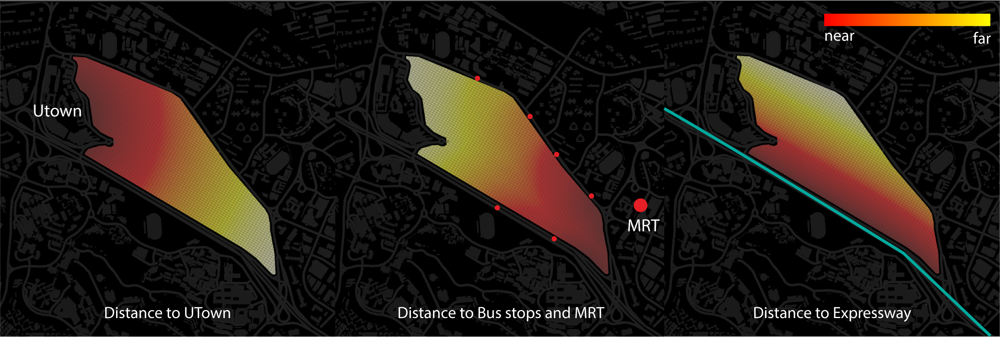

#  Introduction

##  Demographics

The site is situated between UTown and one-north. Our vision is to turn this piece of land into a vibrant clean-tech hub which would become the home for 75,000 residents. 

A portion of the land would be allocated for clean industry and start-up incubators, and there would be an extension to UTown where 22,500 students (30% of total residents) are expected to live on campus and collaborate with the industry nearby. The last portion of land is allocated to the neighborhood where housing, retail and recreation space for 52,500 residents would be provided. These residents would feed into the capacity for the clean tech industry on site or the R&D campus in one-north.

Each person is allotted 35sqm total area. And the area for each function is divided according to the identity of the residents.

Students have 15sqm for living; 6sqm for retail with 7sqm for educational, these two sums up to 13sqm. The last 7 sqm is allocated to Industry where students can work as interns in start-ups.

Ordinary residents have 22sqm for living, 6sqm for Retail and Leisure, and 7sqm for Industry and Office.

##  Site Context

The closest MRT station is one-north and Kent Ridge on the east entry of the site. Pedestrian traffic is expected to be higher here. 

Dover and Buona Vista MRT is accessible by bus, and the site is encompassed by a good number of bus stops.

There is an expressway (AYE) in the south boundary which is a key connection of heavy traffic into the site, but it is also a concern for high noise.

The relationship of these nodes to the site is calculated into distance parameters which would facilitate the design process later.

Furthermore, roads that connect NUS to SP could be cut out to facilitate exchange of students in the two institutions, and an extension to UTown could be constructed to accommodate students from both institutions.

## Building Analysis Parameters

The buildings generated will be analyzed in passive ratio, view factor, solar factor and daylight factor. The default thresholds for a “good building” are as follows:

    If
    View Factor > 0.4
    Daylight Factor > 0.1
    Solar Exposure < 0.2
    The window is "good"
    
    If
    Passive Ratio >  0.5
    Good Window Count > 0.1
    The Building is "good"
