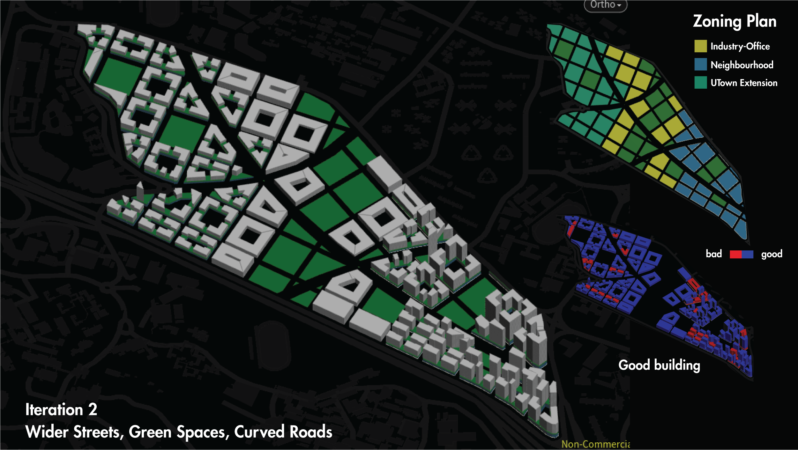

# Gridded to be Voronoi

The first algorithm seeks to simulate a traditional planning process where zones and road networks are planned first and then followed by zoning and typology constrains. It introduces a courtyard-podium typology for high density mixed-used living. 

The algorithm is generated in the following steps:

1.	The main circulation to the existing network is carved out from the site. A simple 3 road system connects the site to the surrounding neighborhood and districts.

2.	The resulting plots of land are divided further into a grid of 120m x 120m. These would be the basic urban block of the city. The size is inspired from the grid size of Barcelona which is highly walkable. 

3.	The parcels are offset 5m from each other, creating 10m wide secondary roads. The maximum distance to a main road from any of the parcels is shorter than 200m. This is a highly walkable distance. That would allow residents to traverse through the city either on foot or vehicle conveniently.

4.	Next, the distance to UTown and one-north MRT calculated previously are used as attractor factors to determine the zones.

*  If distance to Utown < 150m, plots would be allocated to Utown Extension
*   If distance to one-north < 400m, plots would be allocated to residential neighborhood

  The leftover plots would be allocated to high tech industry which promotes student-industry collaboration.

3.	Cut the main circulation from the site
4.	Divide the plot into 120mx120m blocks (these blocks are highly walkable)
5.	Calculate parameters (distance to mrt and utown and aye etc.
6.	Splitting zones
7.	Propose Building Typology
a.	courtyard Podium + Tower type (for wind flow, performance and density)
b.	Courtyard
8.	Populate with typology
9.	Analyse
10.	Other possible iterations (Different Plot Size. Different Road Width, Greenery ratio, high etc.)
11.	conlusion

Main Parameters:

Density of program varies according to:
Distance to Transport Nodes (existing MRT and BUS)
Proximity to Utown

Reduce congestion of traffic towards nodes. 

Industry building growth pattern
Greenspace ratio

