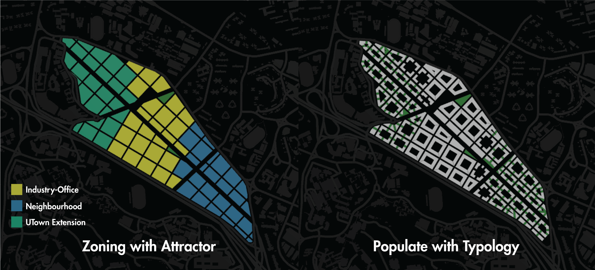
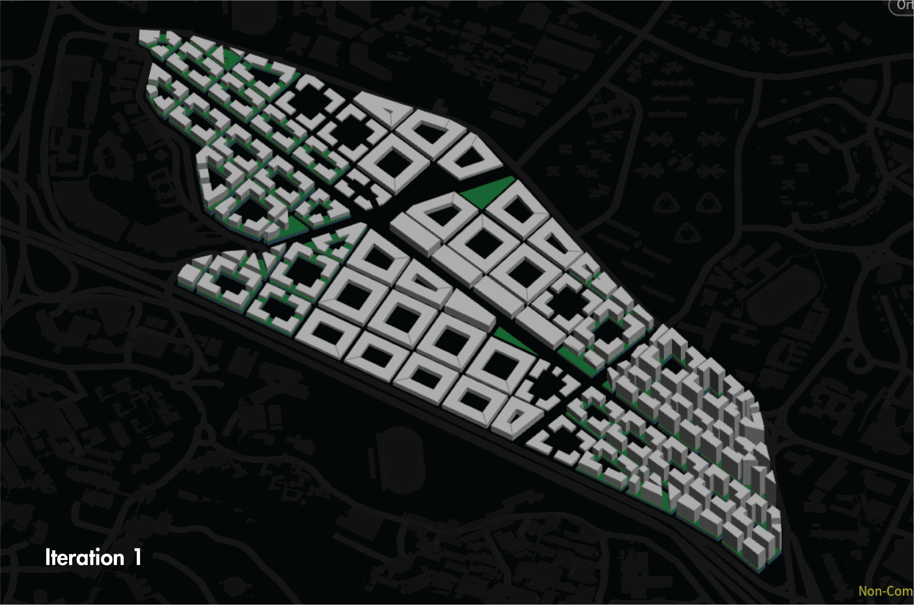
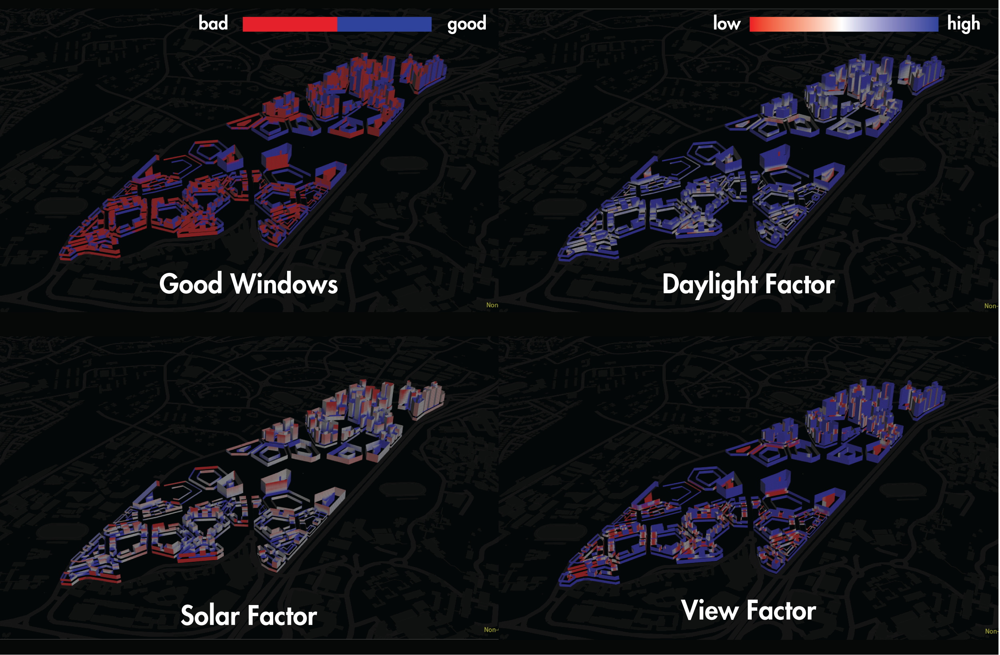

# Gridded to be Voronoi

The first algorithm seeks to simulate a traditional planning process where zones and road networks are planned first and then followed by zoning and typology constrains. It introduces a courtyard-podium typology for high density mixed-used living. 

The algorithm is generated in the following steps:

1.	The main circulation to the existing network is carved out from the site. A simple 3 road system connects the site to the surrounding neighborhood and districts.

2.	The resulting plots of land are divided further into a grid of 120m x 120m. These would be the basic urban block of the city. The size is inspired from the grid size of Barcelona which is highly walkable. 

3.	The parcels are offset 5m from each other, creating 10m wide secondary roads. The maximum distance to a main road from any of the parcels is shorter than 200m. This is a highly walkable distance. That would allow residents to traverse through the city either on foot or vehicle conveniently.

4.	Next, the distance to UTown and one-north MRT calculated previously are used as attractor factors to determine the zones.

       If distance to Utown < 150m, plot alloted as Utown Extension
       If distance to one-north < 400m, plot alloted as residential neighborhood
       The leftover plots alloted to high tech industry.

5.  To ensure a vibrant life, we are proposing a courtyard-podium + tower typology. This is a high density mixed-use typology with commercial and education at the podium and residential in the towers. It is expected to have a high passive ratio and acceptable good window ratio.

6.	The plot is firstly offset from the center with a width of 20m. This would ensure good passive area in the podium.

7.	The podium is extruded according to relative density and the roof is further divided into plots for towers. Each tower is offset 8 meters from each other (16m distance from blocks) to facilitate wind flow through the building and increase view factor.

8.	The towers are raised to create a porous roof level for resident access.

9.	Performance analysis of this typology has returned good results. However, one tower scored low on solar exposure. This is due to a large facade facing the east. This would not be a problem if we consider the towers as one continuous development. The solar exposure ratio would be balanced out by the north south facing windows of other towers. Therefore,  in order to give a balanced overall assesment, we've decided to reduce the solar exposure threashold to 0.25 (easier) and increase the view factor to 0.45 (harder) so as to adapt the thresholds to this specific typology. The rest of the parameters remains unchanged.

10. After populating the plots with this typology, performance analysis has returned a good building percentage of 80% . We see that some buildings are classified as “bad” due to limited view. Therefore, the following improvements are proposed:

       *   A curved main road. (Variety in building orientation)
       *   Wider secondary roads (10m to 16m, better view, wider pedestrain path)
       *   Wider Factories (20m to 30m) to leverage on high passive ratio
       *   Convert 20% of plots to open spaces
       *   Towers vary in height for better view 

11. With the above improvements, good building percentage has increased to 85%. However, the entire urban fabric can be improved further. The rectangular grid could be changed to a Voronoi grid. A Voronoi grid is going to create more turns and multiedged urban block that create more excitement in walking and more dynamism in views

