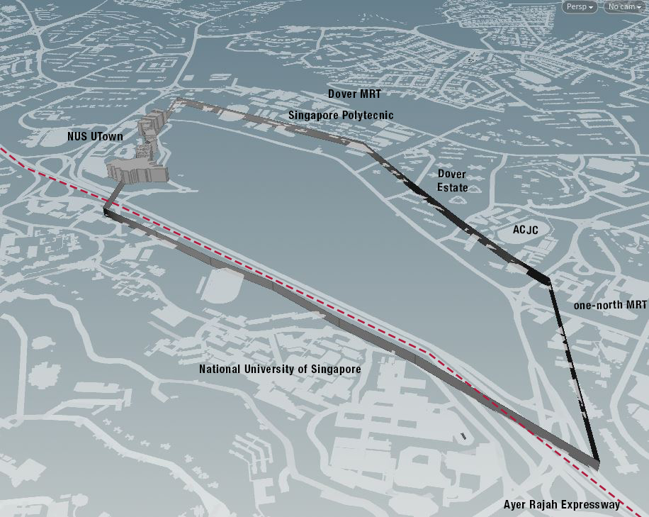

# Introduction

  

 _Site Context and Adjacency Building Coverage_

# Proposed Masterplanning Strategy
The proposed site located adjacent to National University of Singapore and one-north is projected to be an industrial and collaboration hub in the district, tapping upon the wealth of resources and information from the university and one-north. The projected masterplan will house an intensified mix of research clusters, production facilities, housing accommodations and cross disciplinary platforms. Thereby engendering a healthy mix of established industries as well as entrepreneurship startups, a testbed for the development and creation of new technologies and innovation. However the existing site does present certain issues of disconnectivity to its neighbours, segregated by the Ayer Rajah Expressway and several main roads. 

# Site Parameters
Initial response to the site conditions was to develop a way to allocate programs that responds favourably to its neighbours, in terms of reaching the desired population quantity and optimal building form. An urban prototyping study was conducted to devise an urban proposal for the 75ha proposed site with an estimated population of 75000 people. A perimeter wall of 30m is established on the base site plan, an approximate building coverage by neighbouring buildings on site. Additionally, towers from Utown were also modelled as they provide significant coverage on the site. 

# Study Objectives
The goal of the study is to achieve an optimal mix of programmatic spaces, green spaces and collaborative platforms for sharing of information and resources across all expertise on site. Additionally building forms evolve across iterations, responding to climatic factors, active and passive ratios and view potentials. Thereby achieving the most ideal living conditions and sustainable building typologies.

