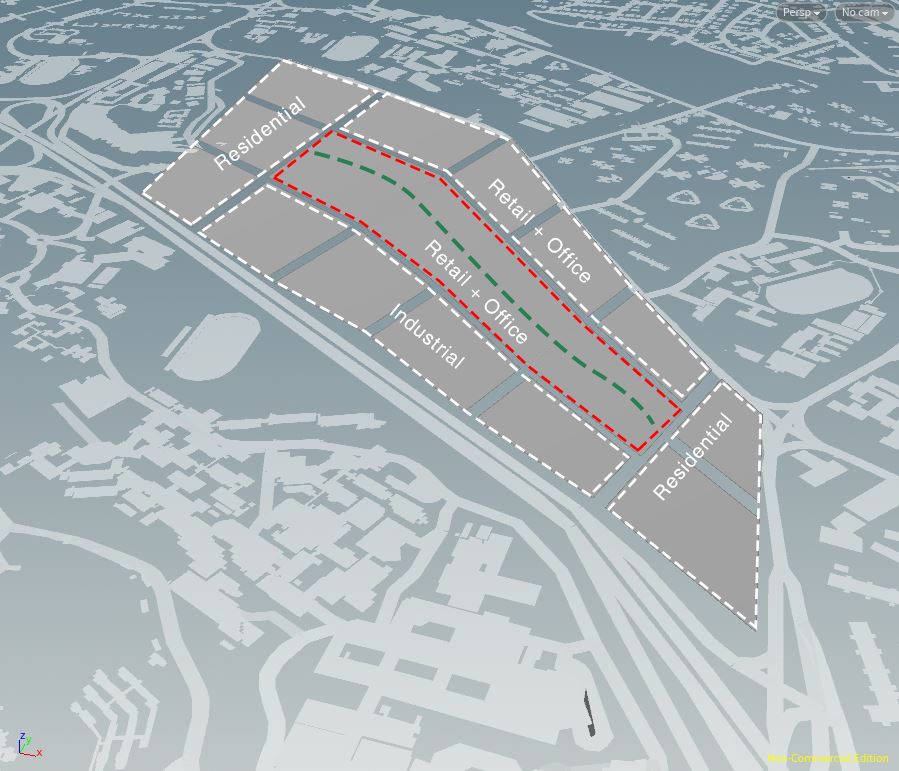
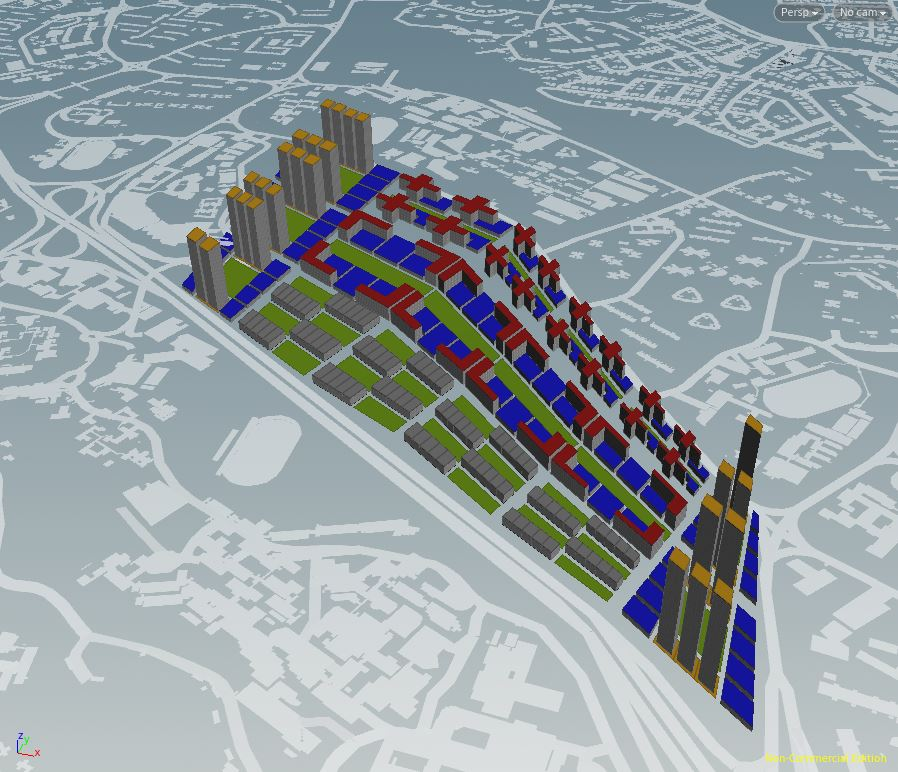
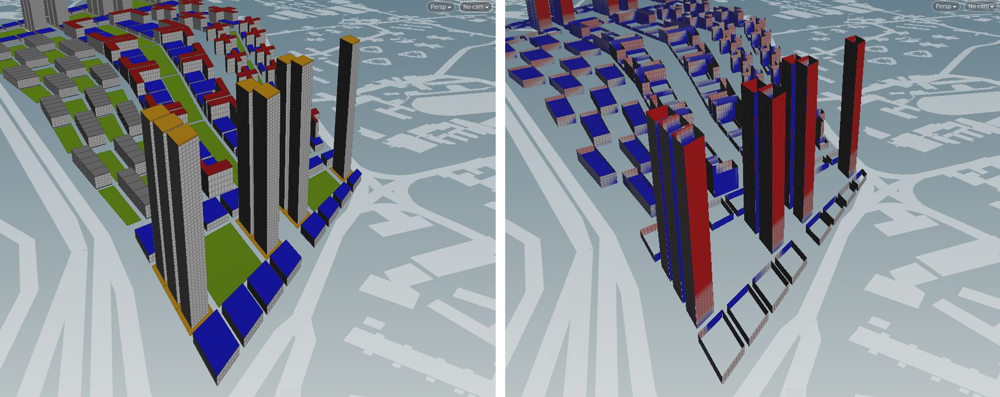
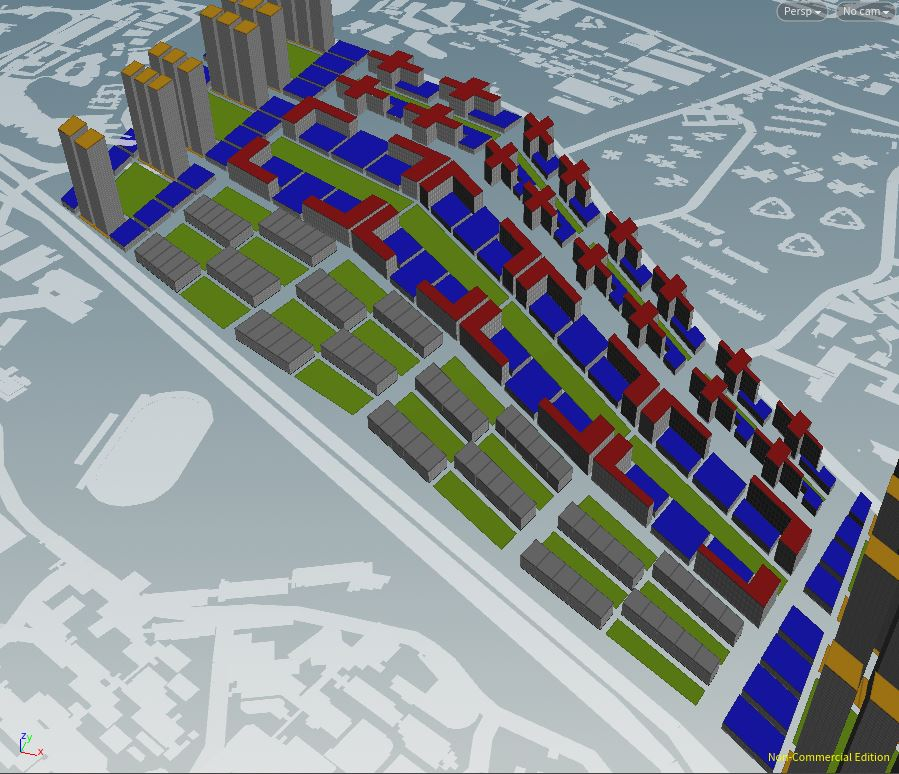
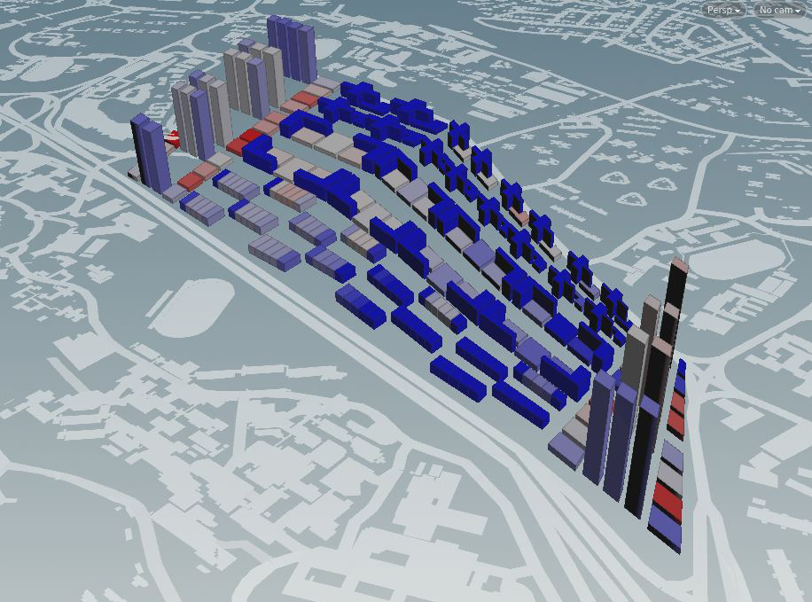
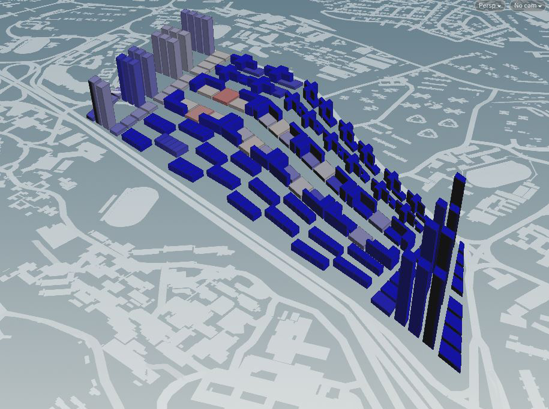
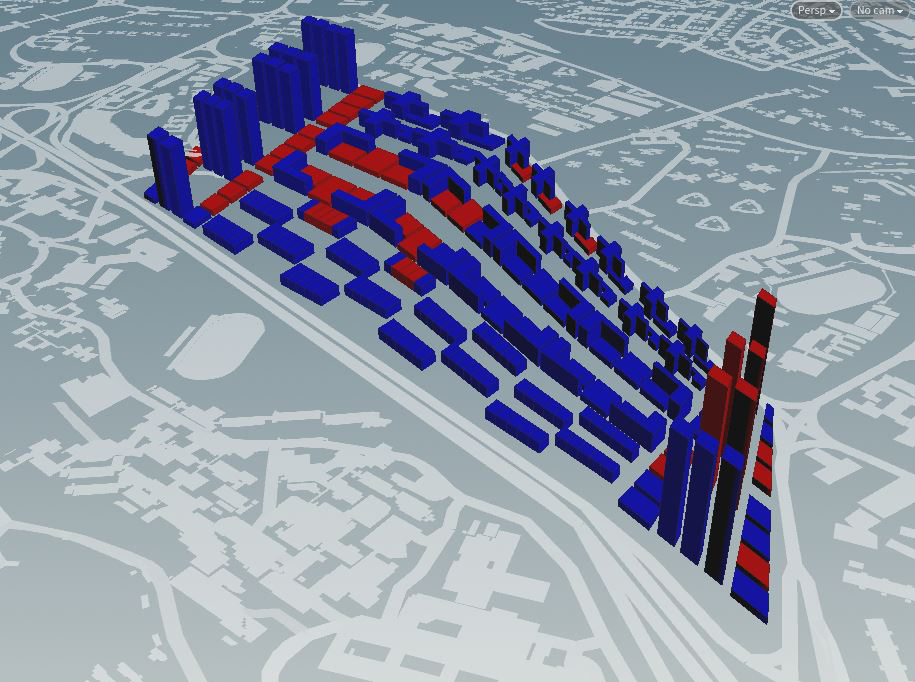

# Iteration 2

 

 _Figure 2a: Plot Allocation_
 
 
  

 _Figure 2b: Iteration 2 overview_

 _(Grey: Industrial, Yellow: Residential, Red: Retail, Blue: Offices, Green: Parks)_
  
For Iteration 2 I wanted to devise a clearer plot allocation that also suggest circulation routes within the site (Figure 2a). The central zone forms a ring road, functioning as the main circulation path for vehicular traffic. Secondary roads branch out from the central main road, towards the outer ring of programs. This filtration of traffic in a radial pattern creates specific parcels of lands around the periphery that contains programs related to existing programs on site.
The overview of the building typologies displays building forms laid out in a band strip on site (Figure 2b).

__1. Central Zone:__ contains mainly commercial retail programs and a green park which stretches the entire length of the plot.

__2. Residential:__ Located at the west and east ends of the site, with close proximity to existing MRT stations. Its location at both ends also allows residents to access the band of programs in the middle of the site.

__3. Industrial:__ Stretches along the length of the AYE.

## Residential Towers
 

 _Figure 2c: Residential Tower and Solar Factor Evaluation_

To reduce residential sprawl within the site, I decided to utilise high rise tower typologies for residential blocks. In Iteration 2, the towers occupy both ends of the site, coupled with low rise office blocks. The juxtaposition of high and low typologies aim to allow optimal views and adequate daylighting. However an undesirable solar factor is observed in this case, specifically in the east-west face of the tower. Subsequent iterations will aim to resolve this issue by rotating the block form to reduce solar exposure.

## Programmatic Strips
 

 _Figure 2d:  Industrial and Commercial District_
 
Arranged in strips, the industrial and commercial clusters connect both ends of residential apartments. Industrial closest to the AYE, followed by retail and office programs above. The respective strips comprises of low rise typologies and a continuous green corridor throughout. The intention was to allow each unit block to have access to open plazas and green spaces, which could also function as exhibition showcase venues and collaborative platforms. Opening along the central area creates access points for the top and bottom bands, allowing programs and circulation to permeate the site.

## Performance Analysis

 

 _Figure 2e: Good Window Factors_
 
 
  

 _Figure 2f: Good Window Results_
 
 
  

 _Figure 2g: Passive Ratio Results_
 
  

 _Figure 2h: Good Building Results_

Overall, the buildings on site displays close to 80% good buildings (Figure 2h). Some low rise office blocks demonstrates a low good window ratio (Figure 2f). This is likely due to being overshadowed by taller tower and their close proximity, resulting in poor view factor and daylight factors. Some of the taller towers facing east also displayed excessive solar factor results. Following iterations work towards orientating the tower to reduce east west facing as well as allowing low rise block to obtain adequate amount of sunlight and views.
