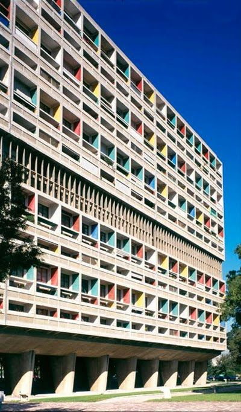
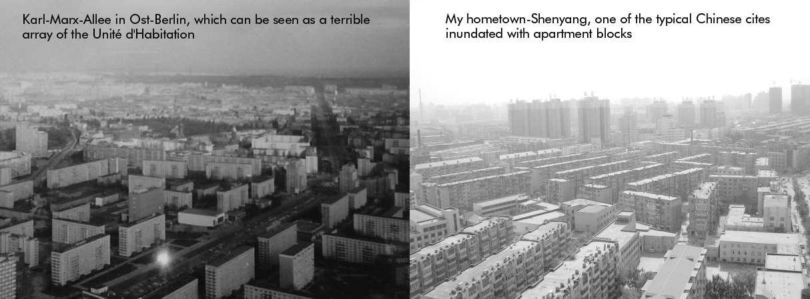
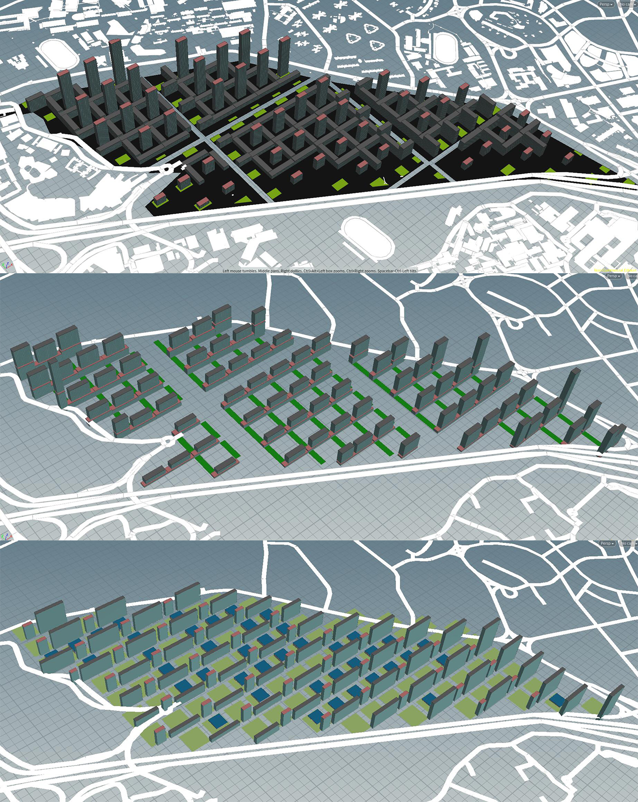
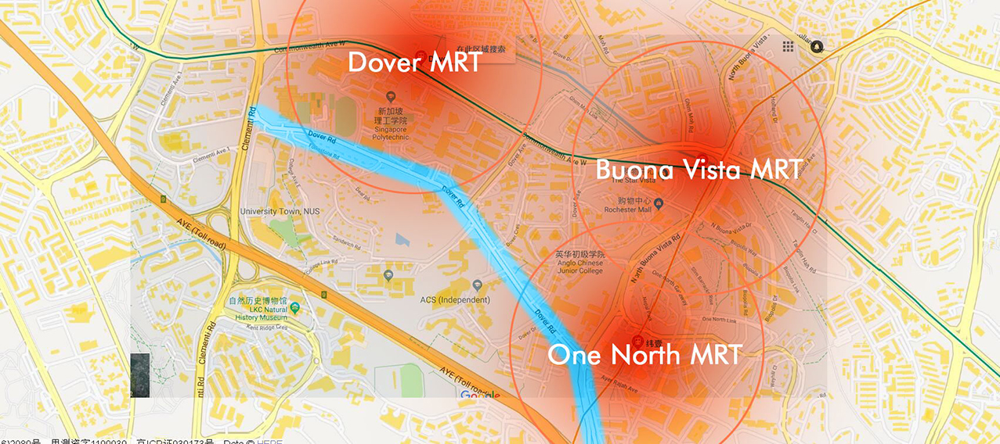

# Introduction

## Background: Ville Radieuse and the array of Unité d'Habitation
  In the concept of Le Corbusier,the relationship between architecture and city is the same as it is between part and whole, and his focusing on city is mainly about structure and form.
  In Ville Radieuse, he revised the previous plan, deleted low-density buildings, and made stilt buildings throughout the site.The ground surface was used for greening, and transportation system was independent.It was more pure than the previous version.The huge building volume has raised the urban space upwards in exchange for huge green spaces and roads.
  

  
  He called for urban models of high-density, high-greening, cohesive, and ration system. His plan finally stayed on the paper stage, the only one built was Marseille apartment( Unité d'Habitation)that reflected some of his ideas, which has a rather clear distinctive strip in the middle of the building that is used to place all the public services.(I tried to imitate this in iteration 2)
  

Yet because of his idea of functionalist zoning coincides with the communist state's emphasis on order and public, therefore, the Soviet Union, China, East Germany and other socialist countries in large part inherited the theory of Corbusier during their postwar reconstruction, which still has an impact today. Other countries like United Kingdom, Netherlands, etc. also have residential areas affected by this theory.

Now it has to be acknowledged that the impersonal functionalist division has a negative impact on the vitality and security of the city. The mixed urban function and the sense of place are the development direction of cites. Despite this, this article still wants to do a series of simulations to test whether its physical parameters can really reach a that high level which Corbusier claims.

In the three iterations, I have carried out several variants of apartment blocks.

Main idea is increasing the population density through large-scale buildings, saving the land to provide sufficient sunshine and greening, and ensuring a neat grid transportation system for travel convenience. Each residential building is connected to a commercial building that can solve the daily life of residents, which contains offices, food courts and other entertainments. I tried to make every building group a self-sustained system. Then through the analysis of its physical parameters, adjust to find whether there is an optimal solution.

Other impacts on the building arrangement are: MRT stations & Dover Road .The closer to the subway station, the more living people there should be, and the closer to Dover Road, the larger the commercial area should be.

