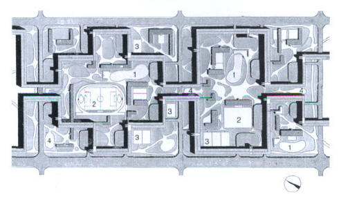

# Introduction

## Background: Ville Radieuse and the array of Unité d'Habitation
  In the concept of Le Corbusier,the relationship between architecture and city is the same as it is between part and whole, and his focusing on city is mainly about structure and form.
  In Ville Radieuse, he revised the previous plan, deleted low-density buildings, and made stilt buildings throughout the site.The ground surface was used for greening, and transportation system was independent.It was more pure than the previous version.The huge building volume has raised the urban space upwards in exchange for huge green spaces and roads.
  

  
  He called for urban models of high-density, high-greening, cohesive, and ration system. His plan finally stayed on the paper stage, the only one built was Marseille apartment( Unité d'Habitation)that reflected some of his ideas, which has a rather clear distinctive strip in the middle of the building that is used to place all the public services.(I tried to imitate this in iteration 2)
  

