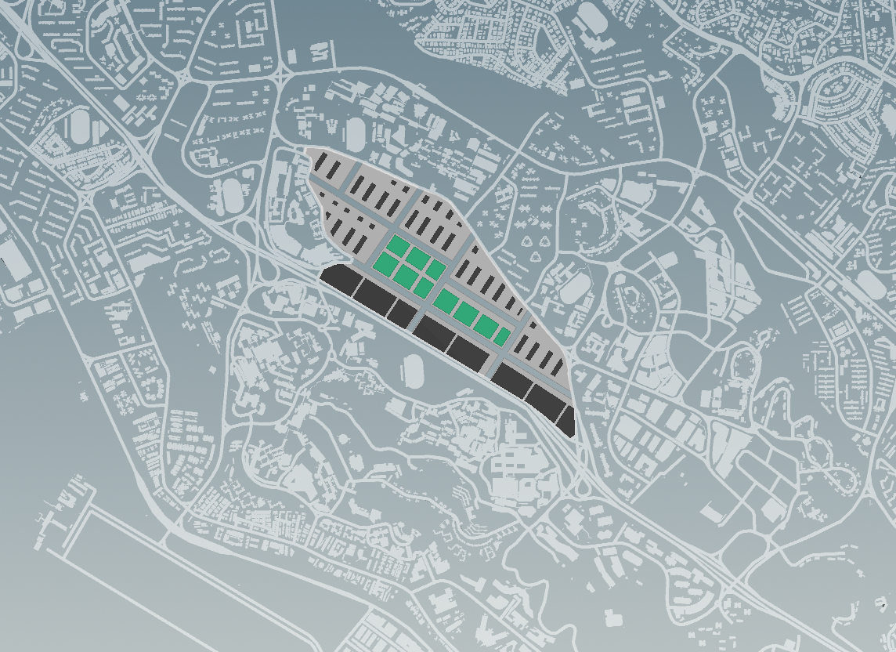
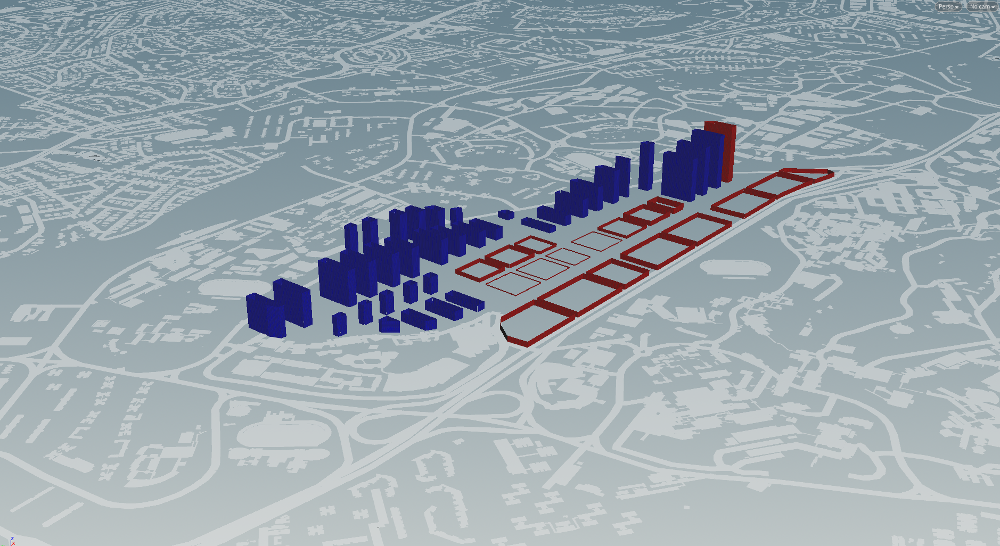
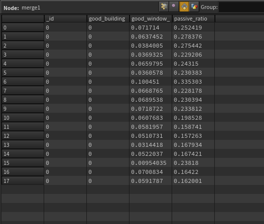
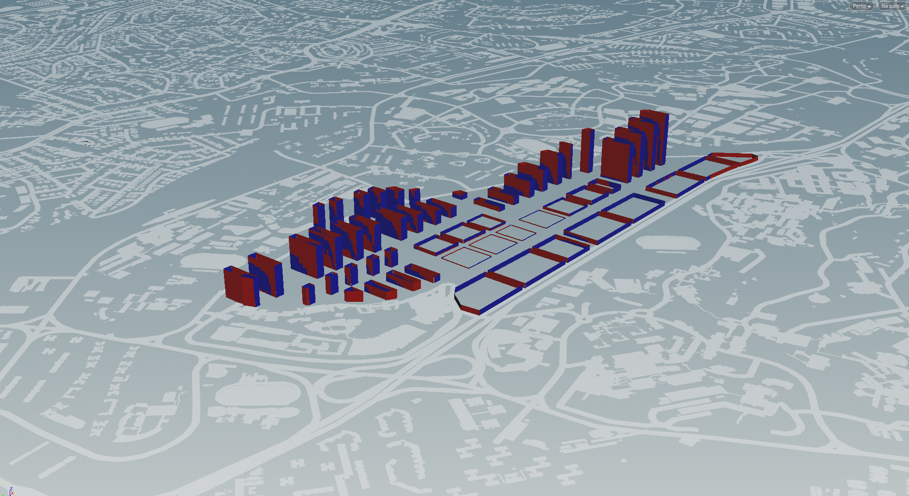

# Iteration 1

The first attempt involves a classification of the plots into 3 different types, residential, commercial and industrial. Each type was then designed with a separate set of attributes and conditions to present different environment in response to their method of use. 

Each residential plot was subdivided to form a mixture of longitudinal blocks of average 25m width (double loaded towers) and point blocks of average 35m in width. Blocks are designed with sufficient space in between to prevent excessive shading while promising a well shaded ground level environment. 

Industrial blocks are designed with a recessed setback of 12m to create a green boulevard between the industrial blocks and the commercial zone. As a result, the built volume will also increase in height due to a smaller footprint. The volumes will thus form a barrier to shield against the AYE road. 

Commercial blocks in the core of the site are kept low while 10% of the total floor area for site is dedicated for its use. 

In the further stages of analysis, is has been realised that a majority of the residential blocks have met the requirements of a satisfactory building whereas 100% of the commercial and industrial blocks are not. This has been attributed to the low passive ratio due to a large footprint.

In addition, a large percentage of the windows of the residential units are reflecting unsatisfactory results to to the east-west facing orientation of the blocks.

Such observations are recorded as indications for the areas of improvement and changes will be reflected in the following attempt of design.
