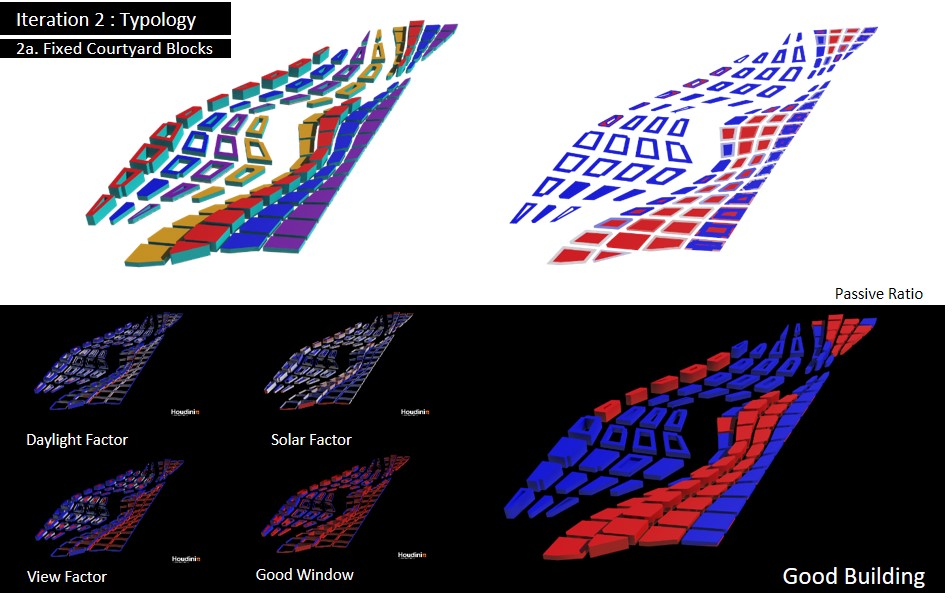
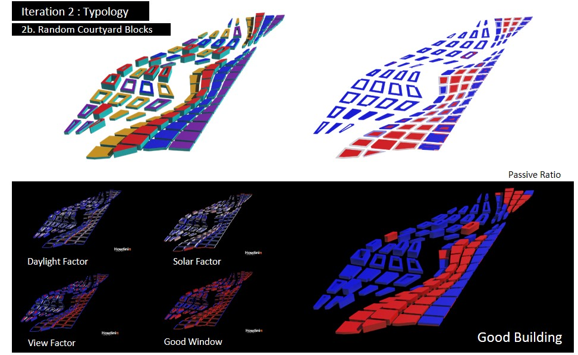

# Iteration 2: Urban Typology (Courtyard Block)

__2.1 Iteration 2A: Fixed Courtyard Blocks__ 

In the second iteration, the study will focus on the courtyard typology on Dover precinct. A 15-metre in width courtyard block is generated for each of the large plot. In doing so, it would also create more public spaces for interactions to occur, especially within the central space of the plot. 

By having courtyard blocks, it created a good passive-active ratio as the courtyard block allows light to penetrate through the floor space. In addition, it created better views for its dwellers as it provide a certain degree of buffer. The daylight and solar factor also registers relatively good results. As such, few bad building exist in Dover precinct. 

__2.2 Iteration 2B: Random Courtyard Blocks__ 

Moving forward, I tried randomizing the courtyard blocks, resulting in a mix of the 4 programs and they responds to the area requirements required to accommodate 75,000 of people. Hence, they vary in heights, giving a more interesting skyline.

By doing so, almost all of its buildings are good building as the courtyard blocks allows light penetration and are spaced well enough for views and acceptable range of solar and daylight factor. The proximity of the blocks have helped to shield excess sunlight from heating up the buildings. 
