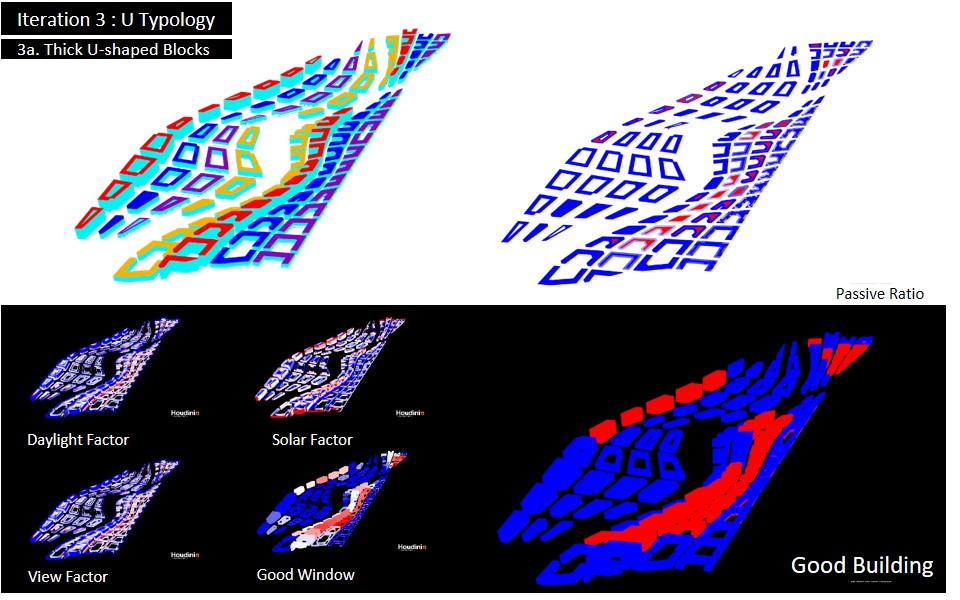
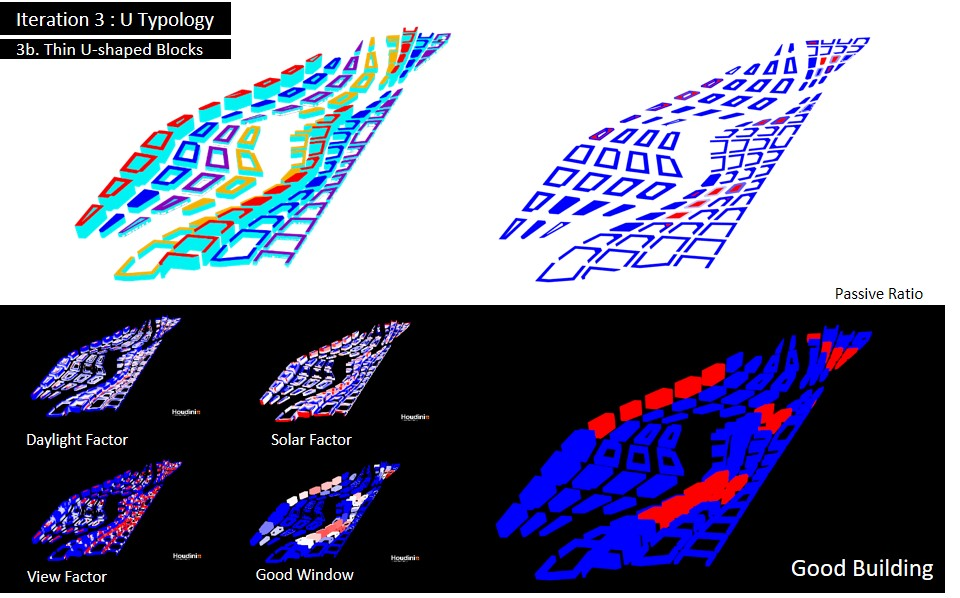
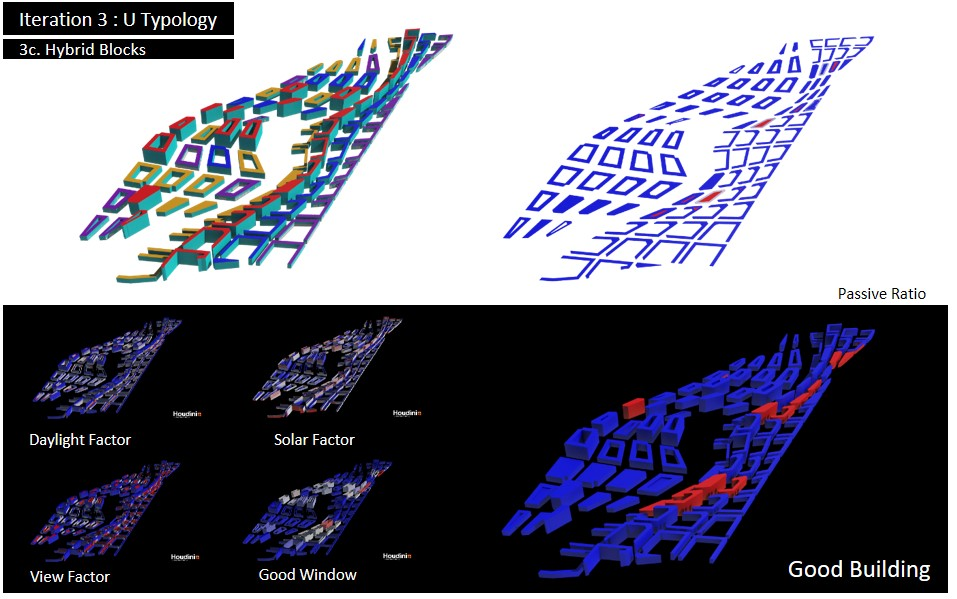

# 3 Iteration 3: Urban Typology (U-shaped blocks)

__3.1 Iteration 3A: Thick U-shaped blocks__

In this iteration, I explore changing the slab and podium blocks of the AYE precinct into U-shaped blocks. This is in reaction to earlier iterations in which views are blocked due to its close proximity with each other. With the U-shaped blocks experimented here, the blocks are kept at 20-metre in width to test the implication of a thick u-shaped block.  

With this iteration, the number of good building has increased. The U-shaped blocks did create better views away and from each of the blocks. However, as the block is relatively thick, many blocks still require active means to get light into the floor space. In addition, some of the blocks are still too thick and thus, register a low view factor. Therefore, while the good window ratio has improved, the thickness of the blocks can be reduced to have more improvements. 

__3.2 Iteration 3B: Thin U-shaped blocks__

A thinner set of u-shaped blocks are used in the AYE precinct to test in this iteration. The blocks are kept at 12-metre width for better light penetration and ventilation. 

With this iteration, I learnt that with the thinner blocks, there are more passive floor space that has natural light coming in and also, have a reasonable daylight factor. Yet, however, due to the proximity of the blocks, the urban form provide enough shade for an acceptable solar factor. At the same time, the thinner blocks also help to ensure less views are obstructed. Hence, the number of good buildings has improved. 

__3.3 Iteration 3C: Hybrid of Random Courtyard Blocks and Thin U-shaped Blocks__

For more interactions to occur along the pedestrian corridor, the random courtyard blocks generated in Iteration 2B are used in Dover precinct while thin u-shaped blocks are used in the AYE precinct. This way, there is a mix of programme in different arrangements in the urban fabric. This way, it may encourage more collaborations between people from NUS Utown and One-North Fusionopolis. 

This iteration show the best result of good buildings on the site. The 2 different typology suit their respective precinct characterized by the curvature of the pedestrian corridor. The courtyard block in Dover precinct helps with daylight and solar factor while protecting views from each other. Its reasonable thickness of courtyard blocks help to keep a good passive floor space for light penetration. 

On AYE precinct, the thin u-shaped courtyard blocks also helps with views and having reasonable daylight and solar factor. The thin width of the blocks also helps with an acceptable passive area for light penetration. Hence, overall, this iteration has the best numbers of good buildings. 
