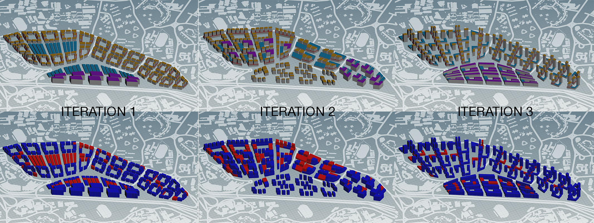

# Discussion

 *Iterations 1, 2 & 3* 
  
Overall, comparing all three iterations, it can be observed that Iteration 3 achieved the best evaluation result with the most number of good buildings. After going through seven rounds of iterations, it was interesting to investigate what was the main cause of the bad building. Reasons for a bad building may include poor view factor, solar factor, daylight factor and passive ratio. More often than not, it is an accumulation of two or more factors. Through understanding where the problem lies, I was able to rectify each iteration and improve them. This was done by either adjusting the plot size, redistributing the plots so that they are not so close together or trying out a new building typology. Sometimes the reason behind a bad building may be due to a technical mistake. For example, in one of my iterations I realised that my office building had internal windows instead of walls. This reflected a poor daylight factor evaluation as these internal windows did not receive sunlight. 

