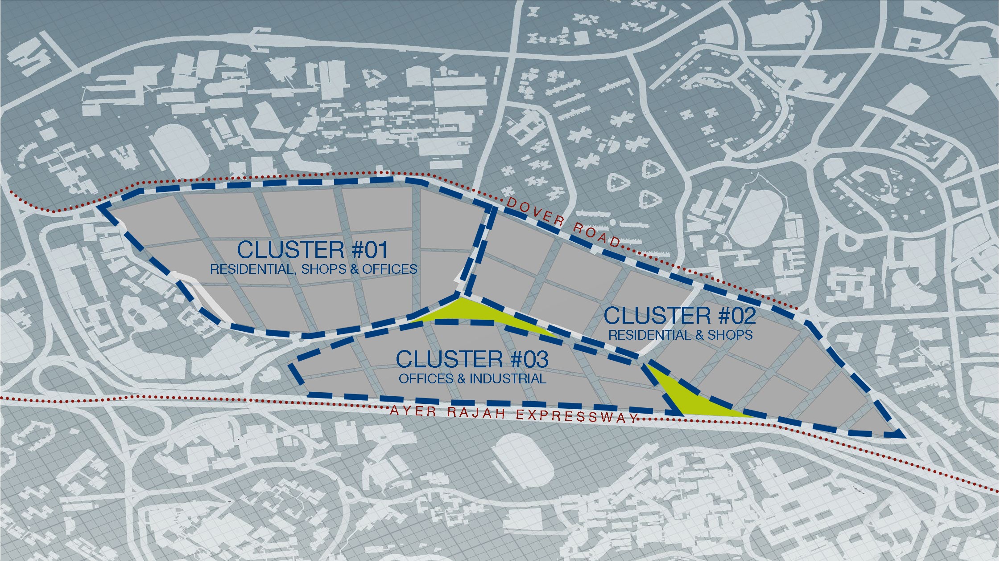
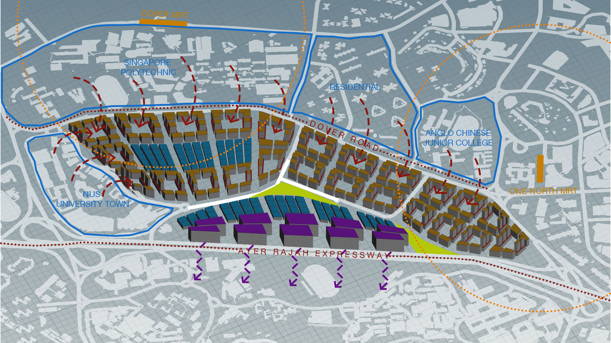
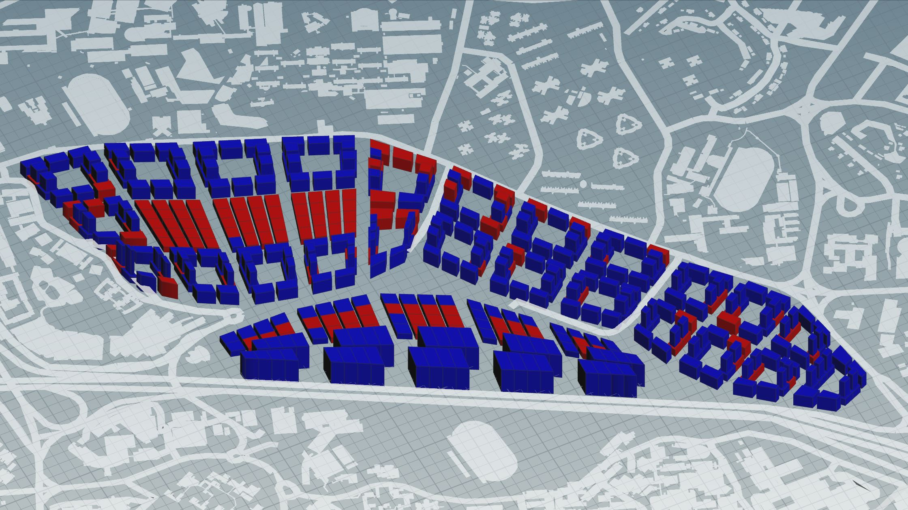
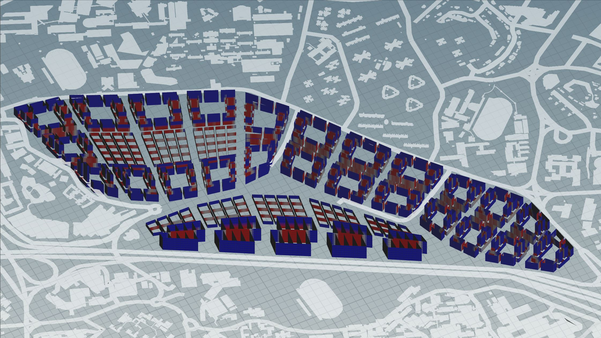
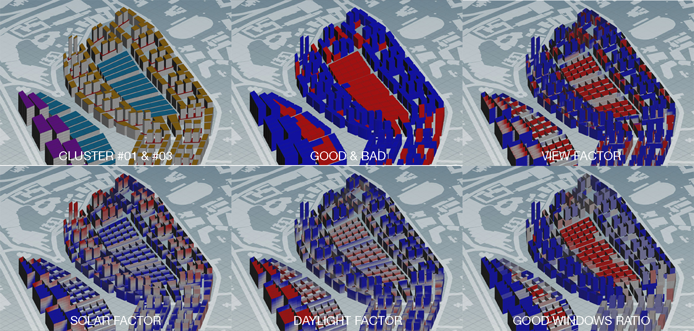
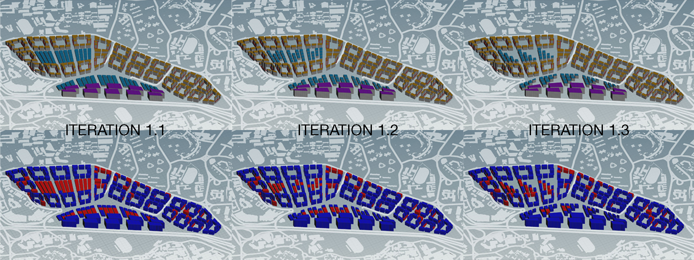

# Iteration 1

## Three Distinct Clusters 

 *Three Distinct Clusters* 
  
The first iteration explores the zoning of three distinct clusters derived from the existing roads, with two parks inserted in between them. Cluster #01 aims to house a mixture of residential, commercial shops and offices, creating a self-sustaining ecosystem. This arrangement is inspired by the work-live-play lifestyle that many are adopting. Similar to Cluster #01, Cluster #02 utilises the podium-tower typology. It consist of mainly mixed-use residential blocks, with commercial shops at the podium and residential tower above. Cluster #03 acts as a buffer zone between the residential areas of the previous two clusters and Ayer Rajah Expressway (AYE). Thus, it is lined with industrial buildings and offices along AYE.

## Distribution of Program

 *Program Distribution*

### Residential *(highlighted in yellow)*
For this iteration, the mixed-use podium-tower block typology was adopted, arranged in a courtyard configuration. Residential blocks are placed within close proximity to the two MRT stations present near the site, namely Dover MRT and one-north MRT. Due to the amount of residential blocks on site, the height distribution is pretty leveled, producing mid rise tower blocks with an average of 13 floors.

### Commercial Shops *(highlighted in red)*
The commercial shops are located underneath alternate residential blocks so as to serve the both local residences, but also students from Anglo Chinese Junior College, NUS UTown and Singapore Polytechnic. These are strategically located around the courtyard so as to provide an alternative meeting spots for students.

### Commercial Shops *(highlighted in blue)*
Offices are mainly present in the centre of Cluster #01 and along the sides of Cluster #03. This is to facilitate a ecosystem of residents who are able to work within close proximity to their homes. Offices are also placed closed to the commercial shops to allow for ease of access to food and beverage outlets during lunch time.

### Industrial *(highlighted in purple)*
Industrial buildings are located along the Ayer Rajah Expressway. Due to their tall floor heights, and huge massing, they are able to act as a buffer to deflect away the noise from the expressway. This reduces the noise heard by the residents who are located further in the site. 

## Overall Evaluation
### Good & Bad Buildings

 *Good & Bad Buildings*

In this evaluation, red denotes a bad building and blue represents a good building. Overall, most of the residential and industrial buildings are considered good. Commercial shops on the podiums and offices turns out to be bad buildings. In order to understand the reason behind these results, we have to look into other components such as view factor, daylight factor and good windows. Each building type will also be discussed in further detail thereafter.

### View Factor

 *View Factor*
 
For the view factor evaluation, red denotes poor view factor, while blue shows good view factor. Overall, the view factor for building along the periphery seems alright, mainly due to the fact that there is no view obstruction. However, for buildings that are positioned too close to each other, for example the office blocks and industrial buildings, the views are obstructed by another building that is too close. In order to counter this issue, the next iteration should look into staggering building positions and leaving more buffer space in between adjacent buildings. 

### Daylight Factor

 *Daylight Factor*
  
Unsurprisingly, the daylight factor for the residential blocks on Cluster #02 are poor (indicated in grey are red) mainly because of the close proximity of the tower blocks. Due to their orientation and position, it has lead them to overshadow each other, thus limiting the daylight exposure. Similarly, for low rise office blocks on Cluster #01, it has caused the internal windows to have a lack of daylight. Another building typology for the offices should be considered.

### Specific Areas of Improvement

 *Comparative Evaluations for Clusters #01 & #03*

The main issues of this iteration lies in Cluster #01 and Cluster #03, specifically the office buildings present in them. From the good and bad buildings evaluation, we can see that the offices are predominantly red, which means they did not fare well in other evaluations. The view factor evaluation indicates that the internal windows are bad, a similar result to the good windows ratio. The solar factor evaluation corresponds to the daylight factor evaluation as the office buildings do not receive ample sunlight. Due to the closeness and tight packed nature of these buildings, they are causing them to be bad buildings. 

### Improved Iterations

 *Iterations 1.1, 1.2 and 1.3*

In order to tackle the bad office building layout, two other configurations were tested out to improve the evaluation results. In Iteration 1.2, the distance between offices were increased and a staggered placement of the buildings was employed. This reduced the number of bad buildings (indicated in red) from Iteration 1.1 to Iteration 1.2. However, on the whole, Iteration 1.2 still has quite a number of bad office buildings in Cluster #03. Thus, another configuration was tested out in Iteration 1.3, which proved to be effective in reducing the number of bad office buildings in Cluster #03. 

 
