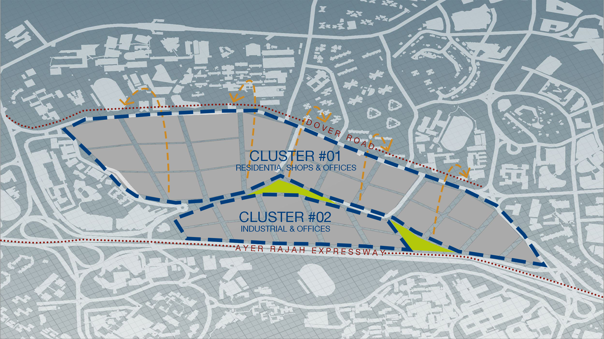
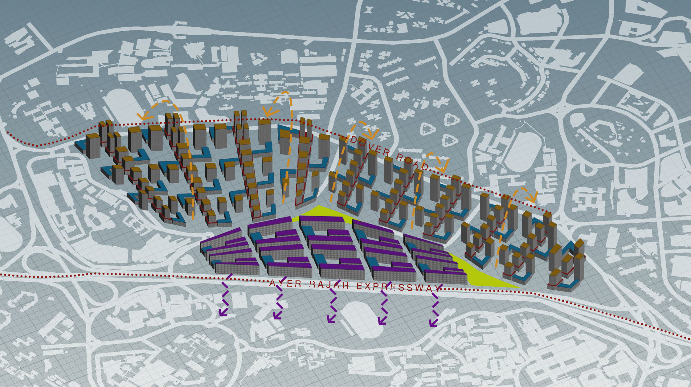
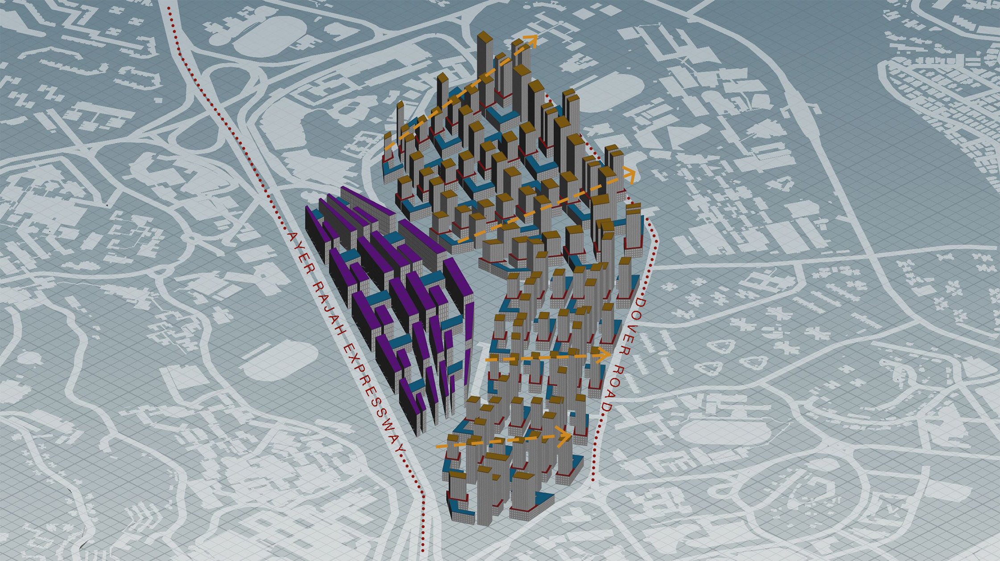
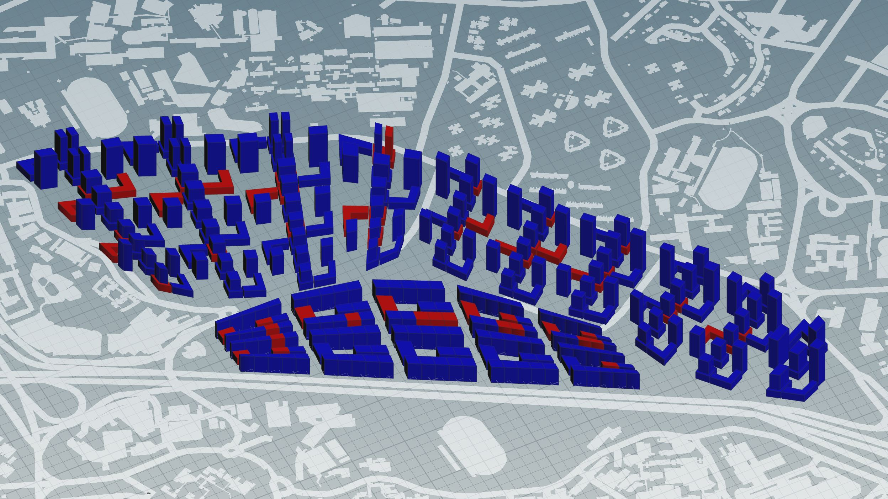
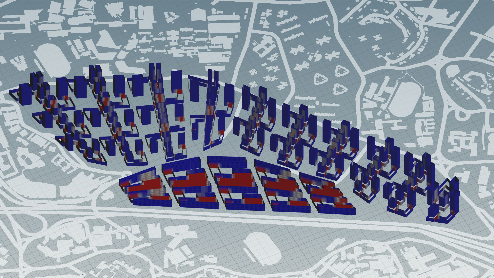
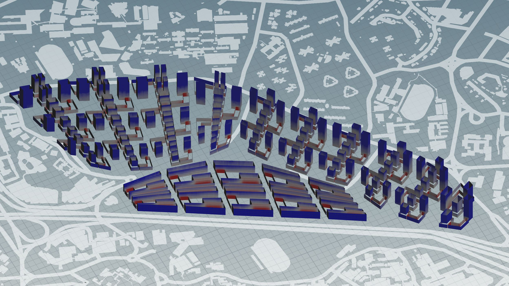
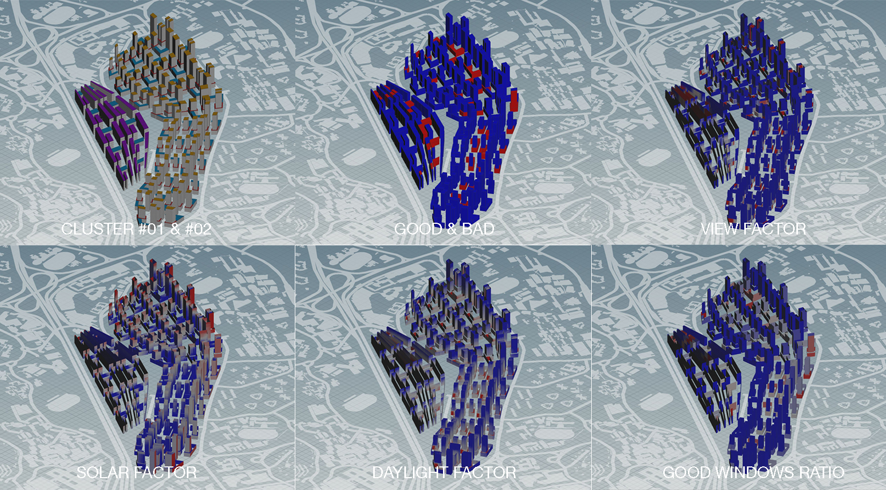

# Iteration 3

## Two Main Clusters 

 *Two Main Clusters* 
  
Instead of having multiple clusters serving different functions, this last iteration aims to explore just two main clusters. Cluster #01 containing a mix of residential, commercial shops and offices. While Cluster #02 is focused on industrial buildings with adjacent offices. Moving on from the courtyard typology used in the previous two iterations, this iteration aims to explore the potential of using  a cross layout for the residential buildings. Distance from Dover Road is also considered while generating the heights of the residential building.

## Distribution of Program

 * Program Distribution* 

### Residential, Shops and Offices *(highlighted in yellow, red and blue respectively)*
Residential, Shops and Offices are mainly congregated in Cluster #01. The residential building height also takes into account the proximity to Dover Road, with buildings closer to Dover Road being higher than the rest which are further away. This is illustrated below. The cross arrangement provides ample space for green spaces and cross ventilation. Due to the limited plot size,  this creates taller residential towers, with the tallest having 44 floors. 

  *Ramped Distribution of Height* 

### Industrial Buildings and Offices
Similar to Iteration 1, Cluster #02 is reserved for industrial buildings and offices. Their placement is mainly due to Ayer Rajah Expressway which runs parallel to the site. In order not to cause any disruption to residents, these industrial buildings are arranged parallel to the expressway, so as to act as a defensive wall of sorts. 

## Overall Evaluation

### Good & Bad Buildings

  *Good & Bad Buildings* 

Comparatively, this iteration seems to yield the most number of good buildings. Most of the residential buildings are good buildings, this may be due to its slenderness and height which allows for unobstructed views, thus improving the view factor evaluation.

### View Factor

  *View Factor* 
  
As most of the buildings in this evaluation sits on a relatively smaller plot compared to the previous two iterations, it has resulted in the building being much taller than others. This had a positive impact on the view factor results. The spread out nature of buildings also improved the view factor tremendously, with many facades reflecting a blue colour (good).

### Daylight Factor

  *Daylight Factor* 

Daylight factor is correlated to the view factor. Since buildings in this iteration do not obstruct one another, it has a good daylight factor, with many facades receiving ample amount of daylight. 

### Comparative Evaluations

  *Comparative Evaluations for Clusters #01 & #02* 
  
Looking through all the evaluations, Iteration 3 has pretty decent results. Besides some anomalies here and there (which could not be helped regardless of what I did).  

