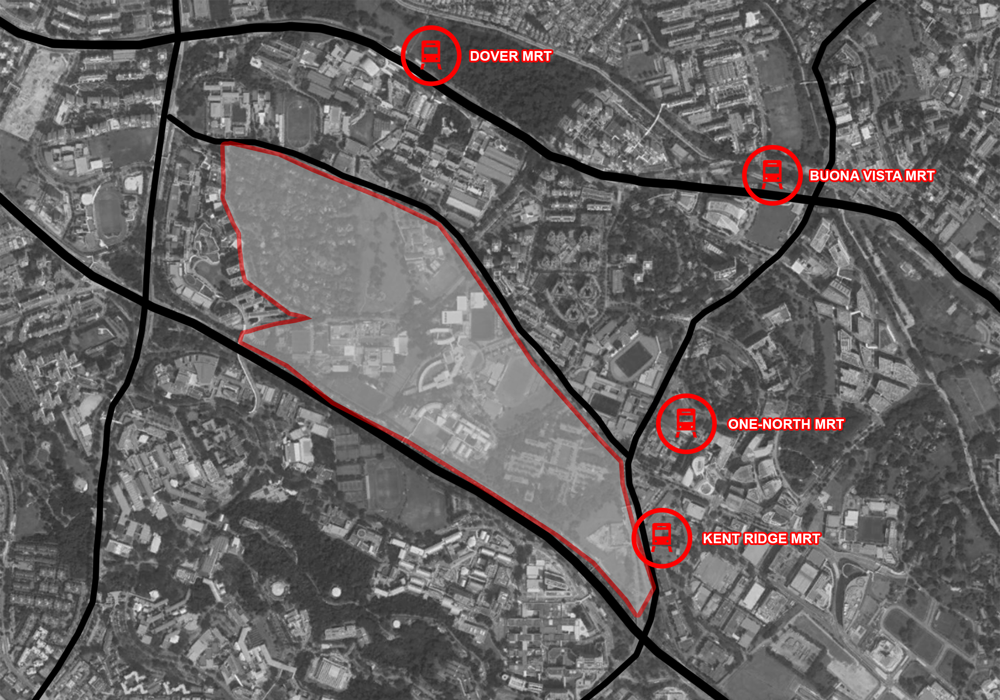
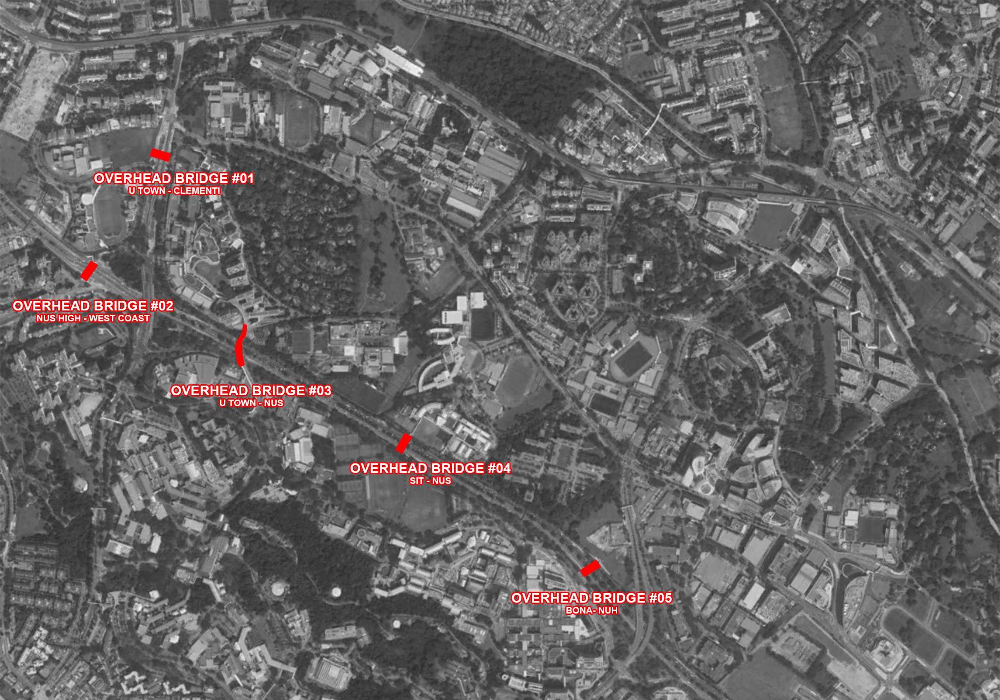
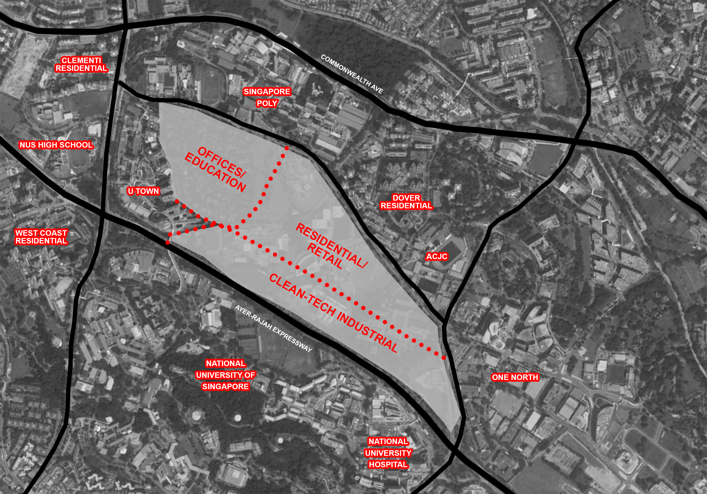

# Ridge

The Ridge is located at a 75ha plot of land at Dover and is conceptualised as a continuation of urban fabric from the National University of Singapore located at Kent Ridge. The project will undergo intensification comprising of research-oriented programs and residential blocks to function as a self-sufficient mini-city. Ridge as a design concept adopts an incremental building form in the manner of intensification relevant to specific site conditions such as proximity to public transport amenities and overhead bridges.

The impetus of the project will focus on the liveability of inhabitants. Beginning from 1927, Singapore has seen a number of changes in its public housing planning policies. Today, the Urban Redevelopment Authority (URA) shifts its focus on creating self-sufficient towns and districts that possesses a variety of amenities catered to residents living in the area. This is evident in the development of concept plans such as Tengah and the recently constructed Kampung Admiralty. In such large-scale developments, stakeholders, developers and statutory authorities often partake in feasibility studies to assess the merit of a potential real estate investment. This is common practice as the analysis will inform stakeholders of the financial viability of the project in the long run. Creating economically-sustainable models becomes the primary concern for developers.

URA’s concept in bringing back the ‘kampung spirit’ in Kampung Admiralty reminds us that the well-being of inhabitants should remain at the core of the design process. There are many precedence in conducting meaningful feasibility studies. On the other hand, the liveability of residents play second fiddle to economic interests and are always assessed after a few years of occupation. This retrospective approach of identifying flaws and faults in design decisions is largely futile. 

## Requirements

Some parameters of the project established are as follows:

| No. of Persons  | Floor Area per Person | Total Floor Area  |
| ------------- | ------------- | ------------- |
| 75 000  | 35m2  | 2.6 million m2  |

With research and education as the main backbone of the program, the floor area allocated per person are broken down as follows:

| Residential  | Offices / Education | Retail  | Clean-tech Industrial  | Total Floor Area per Person  |
| ------------- | ------------- | ------------- | ------------- | ------------- |
| 22m2  | 8m2  | 2 m2  | 3 m2  | 35 m2  |

## Site Conditions
Firstly, since the majority of residents living in the area are students and young adults, it is expected that there will be a high dependency on public transport systems. Secondly, the Ayer-Rajah Expressway (AYE) along South of the site is expected to be an undesirable source of air and noise pollution. The 6-lane expressway disconnects the site from the National University of Singapore (NUS) campus and the West Coast residential enclave. To get across AYE, one must use one of five overhead pedestrian bridges identified in the site surrounding. The following diagrams presents the location of Mass-Rapid Transit (MRT) stations and overhead pedestrian bridges in the site vicinity: 

## Design Goals
With the existing site conditions in mind, a concept plan in relation to surrounding developments was generated to kickstart the iterative urban prototyping process. 

The design goals are:
  **1.  Clean-Tech Industrial will be located along AYE as it is an undesirable source of air and noise pollution.**

  **2.  Residential spaces will be located along Dover Road to be in close proximity to existing MRT stations (Dover MRT, One-North MRT and Kent Ridge MRT). These spaces are located in the middle of Offices/Education and Industrial spaces as they are to be shared among either users.**

  **3.  Residents in the area must be within comfortable walking distance to existing overhead bridges so that there is a continuous flow instead of a disconnection created by AYE.**

To guide the evaluation process, each of the iterations will be tested against the following ‘liveable’ conditions:

  **a.  Daylight Factor - assesses the quality of natural lighting (sunlight) on a surface**
  **b.  Solar Factor - assesses the amount of heat passing through a surface**
  **c.  View Factor - assesses the availability and quality of vistas**

In conclusion, the study identifies ‘good’ buildings in each urban massing iteration. In addition to the liveable conditions mentioned above, ‘good’ buildings must adhere to the design goals established.
