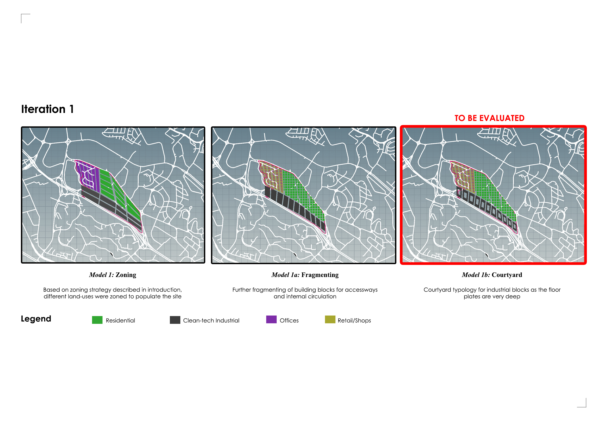
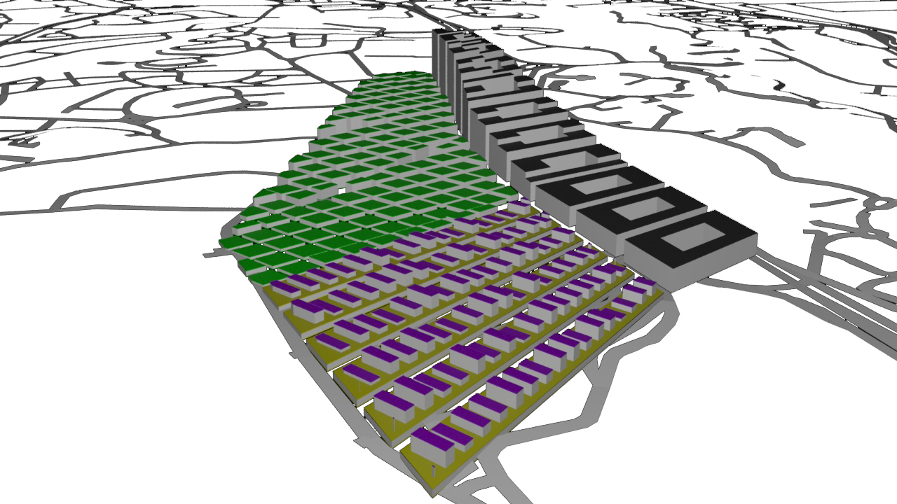
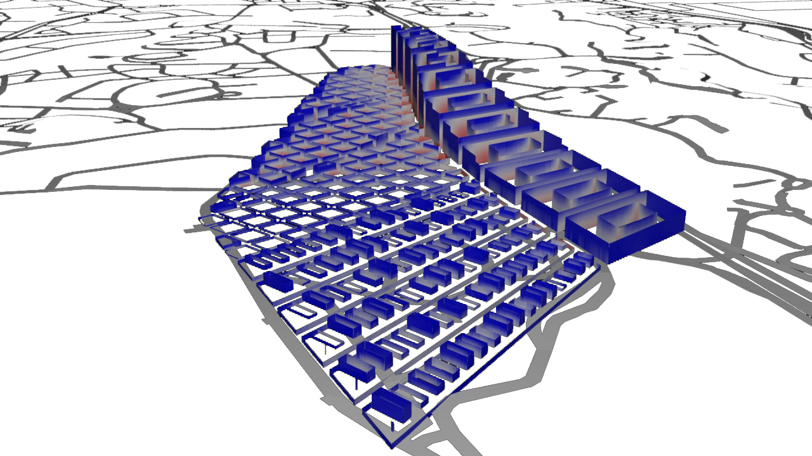

# Iteration 1
The following strategies and typologies were adopted to derive Model 1b which will be the target for evaluation. As a result of the proposed 10m floor height and the deep floor plates of the industrial building blocks, it is expected that internal areas will receive minimal daylight. As a hypothesis, a courtyard typology is expected to alleviate the problem. 

## Model 1b: Overall 
Residential and Clean-tech Industrial blocks were aggregated in terms of intensity towards One-North, Kent Ridge and Buona Vista MRT. That is to say, there is an increasing number of units from the West towards the East of the site because its proximity to surrounding MRT stations. This explains the ‘mountainous’ typology resulted in this parametric rule. Shops and Offices were planned along Clementi Road (West) as it is envisioned that there will be greater integration between research institutes (University Town) and research industries (new offices shaded in purple). 

### Model 1b: Daylight Factor

The Daylight Factor assessment fares well as a result of the ‘mountainous’ typology. The urban form maximises the surface area of exposure of individual building blocks which explains the majority of blue zones seen in the evaluation. As a result Daylight is able to reach deeper areas of the building block. 

However, a closer look at the model reveals certain areas that are affected as a result of the close proximity between building blocks. A majority of these building blocks are set apart at a minimum distance of 5 metre. However, this becomes increasingly insufficient as building blocks increase in height. 

### Model 1b: Solar Factor
Solar gain is at its highest on the East and West facade of the model. However, the building typology allows a fair amount of shading in individual units. The building model was generated in a linear process in the sense that it is at its lowest in the West orientation (6m high) and peaks gradually in the East orientation (40m high). That is to say, units are well-shaded from the evening sun but not as effective in the case of the morning sun. 

The North and South orientation reflects neutral values in terms of the Solar Factor assessment. A closer look at the model confirms that the ‘red zones’ are founded in unshaded area at the higher storeys of individual units and receives a majority of the morning sun (East). 

### Model 1b: View Factor
As mentioned earlier, building blocks are set apart at a minimum distance of 5m. In such instances, there are restricted views within individual units with the exception of units located at the higher storeys. 

A closer look at the model reveals only a small number of units located at higher storeys satisfy the rules set out in the View Factor assessment. The yellow lines indicated in Diagram 1.3 are the only examples of possible unrestricted views in this model. 

## Model 1b: Performance Summary
Final results indicate that none of the buildings are deemed ‘good’ buildings. That is to say that the model has failed to satisfy at least one of the assessment rules (Daylight Factor, Solar Factor or View Factor). In summary, the View Factor performs the worst out of the three owing to the close proximity between building blocks. We learn from Model 1b that the distance between building blocks directly affects the three different assessment criterias. 

