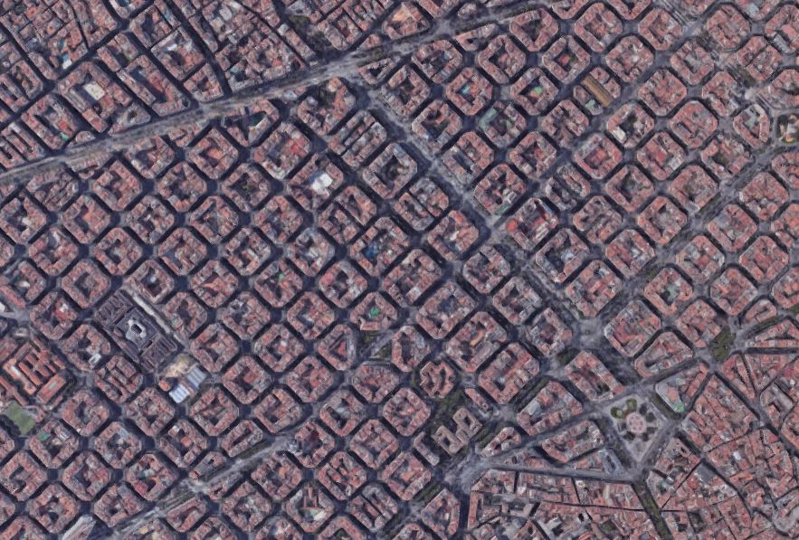

# Introduction

This project was inspired by the urban planning done in Barcelona - my personal experience of exploring the streets of Barcelona was very enjoyable. It was lively and exciting at every turn, yet well structured and easy to navigate around.

The essence of Barcelona is its octagon-shaped building blocks. A basic grid is further chamfered at its corners to give the building blocks its unique shape. Applying this concept to my project, I hope to find out if such a configuration could work in Singapore, and if how edits can be made to make the layout better.

 
Source: Google Maps

```
The thresholds for determining a good/bad building is as follows:
Good window thresholds
   View threshold > 0.4
   Daylight threshold > 0.1
   Solar threshold < 0.2
Good building thresholds
   Passive threshold > 0.5
   Good window threshold > 0.1
```

This node is present in all my iterations, used to create the octogonal shape of the building blocks.

>Make Octogon node:
>
>alt="octogon" width="482" height="750" border="10" />
>
>The 4 corners of the square are individually selected, then boolean-intersected with smaller squares rotated at a 45 degree angle, to create the octogon.
