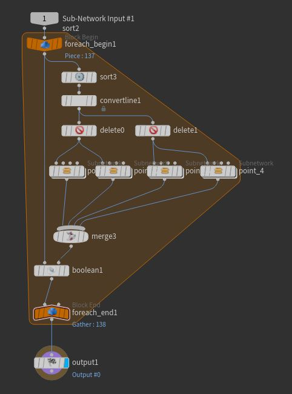

# Iteration 1a

An octogonal grid is first constructed. Then courtyards are punched into the individual building blocks, and plot areas less than 1000m2 are converted into parks. 

(work flow) 

Grid > Polyexpand > 'Make-Octogon' > Boolean Intersect (with site) > Boolean Intersect (with courtyards)

(view factor)
(passive factor)
(good buildings)

The results were astonishing as almost all the buildings were bad buildings. 

After going through the evaluation nodes I realised the reasons why.
1. The buliding blocks were too close together, resulting in bad views and subsequently bad windows. 
2. The individual buildings were too wide, resulting in a bad passive factor and subsequently bad buildings.

>Make Octogon node:
>
> 
>
>alt="octogon" width="240" height="180" border="10" /></a>
>
>The 4 corners of the square are individually selected, then boolean-intersected with smaller squares rotated at a 45 degree angle, to create >the octogon.
