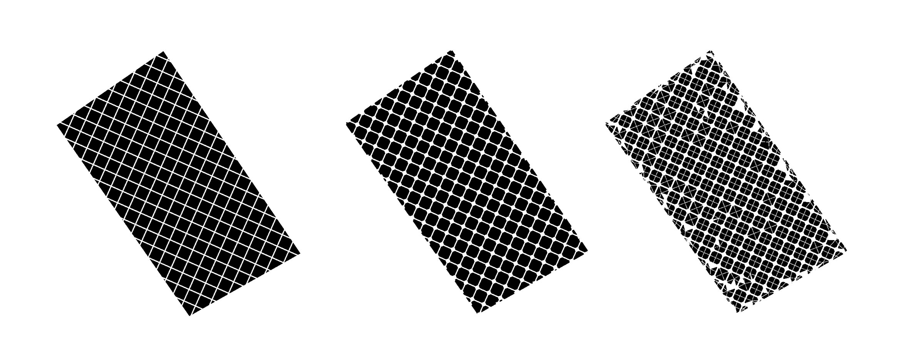
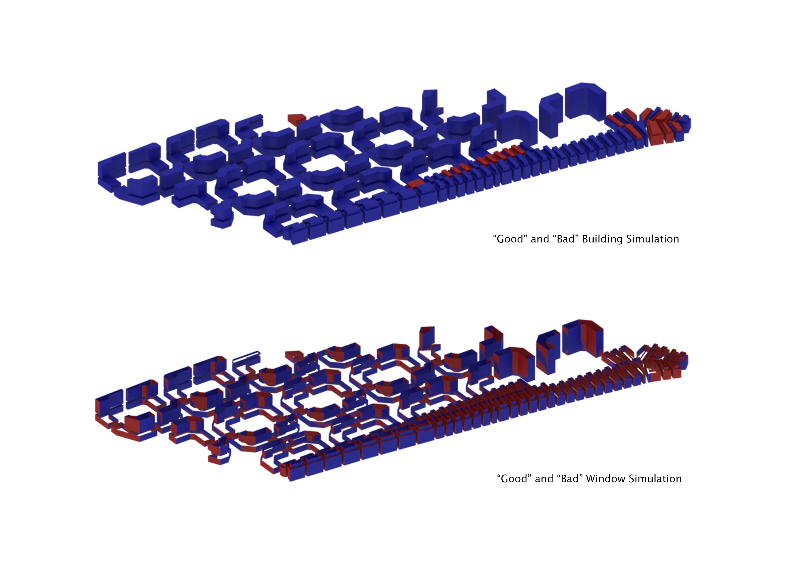
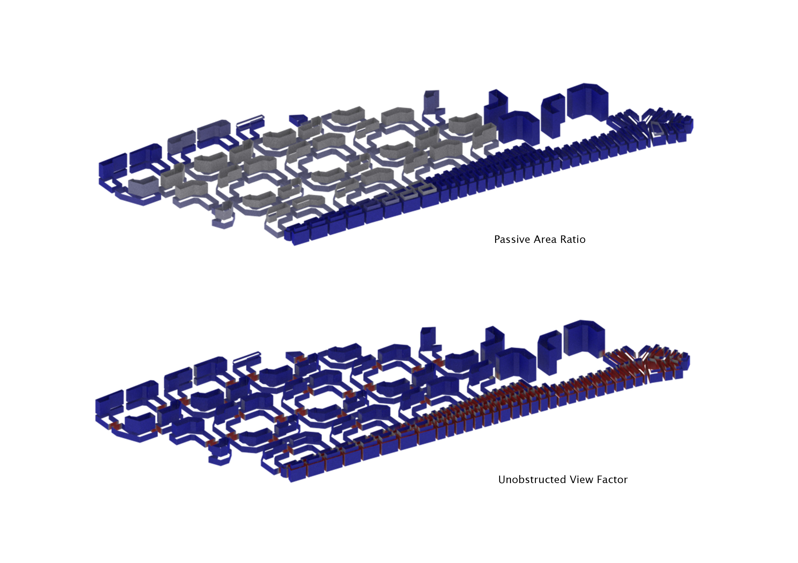
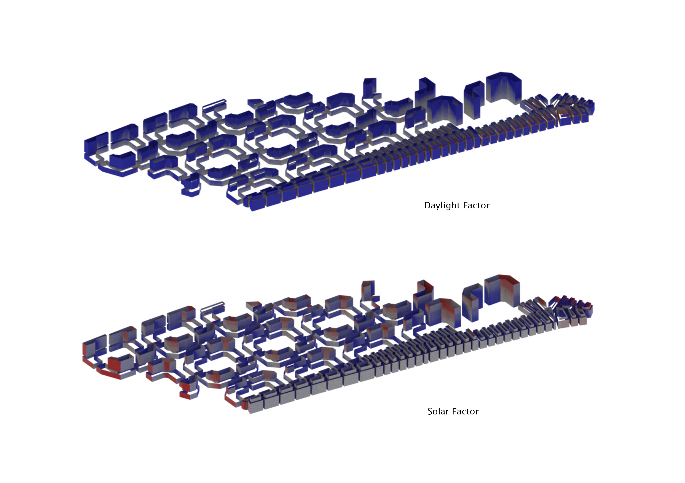
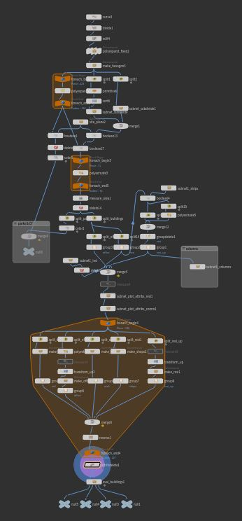

# Iteration 3b

For iteration 3b, Voronoi Fracture is experimented on the industrial urban blocks. This creates 2 rows of industrials buildings, instead of 3 rows (in iteration 3a). The middle rows in iteration 3a are thus gotten rid of because they do not have a good unobstructed view factor.

>Grid> Polyexpand> Split> 'Make-Octogon'> Boolean Intersect (with site)> Boolean Intersect (with courtyard)> Split (different typologies)

**Final results**

Total number of buildings evaluated: 199

"Good" Building Ratio: 94.97%

"Good" Window Ratio: 55.75%

Passive Area Ratio: 100%

Unobstructed View Factor Ratio: 77.96%

Daylight Factor Ratio: 82.40%

Solar Factor Ratio: 79.04%

Conclusion

Almost 100% "good" building ratio has been achieved. The industrial/office building blocks that are hidden behind the shopping malls are deleted because they are unable to enjoy good unobstructed views. The leftover land can be converted into a public park, possibly used to hold events and festivals near the shopping malls, acting as a node within the neighbourhood.

Houdini overall workflow:

