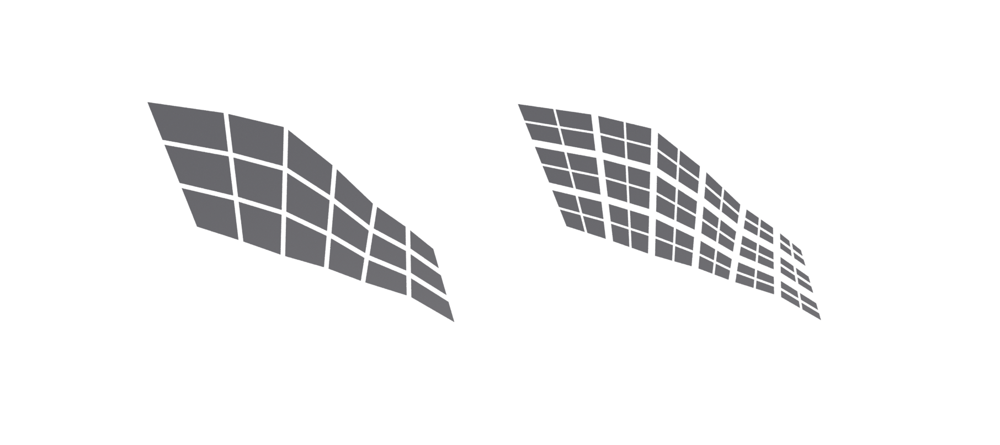
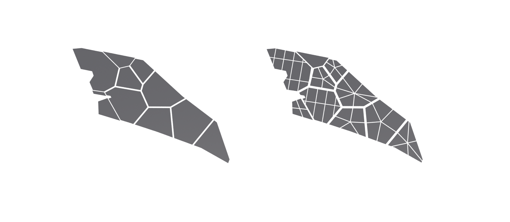

# Introduction

This chapter focuses on three primary objectives - to create non-parallel roads within districts that manifests the Dutch concept of woonerf streets, work-live mini urban plots that facilitate easy transportation between home, recreation and the office, and lastly on Singapore's idea of a Garden City where plenty of green spaces are catered for in the form of shared courtyards and setbacks.

The first two iterations will revolve around the same three road networks shown below.

**Road Network 01**

This network acts as a control to test the efficiency of an urban typology in a generic grid system. Five primary roads run in the North-South axis while 3 in the East-West axis parallel to the site boundaries. Each plot is then subdivided into four individual plots by two secondary roads.

**Road Network 02**

The second network that was tested uses the Sidefx function "voronoi fracture" to obtain an irregular system of primary and secondary roads. There are two kinds of plots that do not have this irregular pattern - the geometries with 4 vertices and those with more than 7 vertices. Due to the way the function "subdivide" works, a geometry with 4 vertices will be split into 4 subplots reminiscent of the grid structure in Road Network 01. As for those with more than 7 vertices, a grid structure was used due to the limitations of the "subdivide" function.

This road network pushes the idea of a woonerf street on an urban scale for a car-lite and pedestrian-friendly neighbourhood. 

**Road Network 03**

The third network fuses the idea of a grid and the woonerf. By extending existing roads into the site with two vertical primary roads and one horizontal across, a network of irregular secondary roads are formed within the six subsequent plots. This would cater to both the high-speed motorists passing through and residents.

[^2]: Subsequent simulations will be based on the following standards:
* For good windows,
  * view_threshold>0.4
  * daylight_threshold>0.1
  * solar_threshold<0.2
* For good building thresholds,
  * passive_threshold>0.5
  * good_window_threshold>0.1
