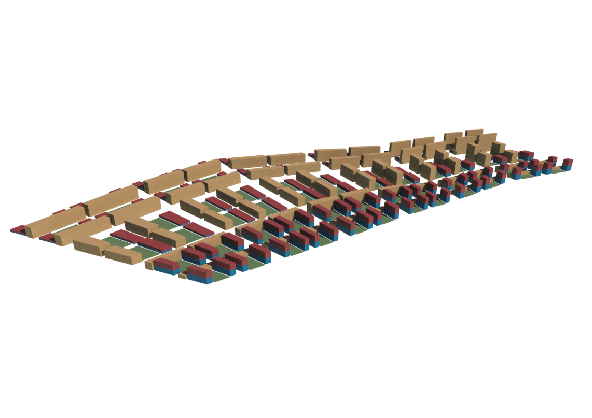
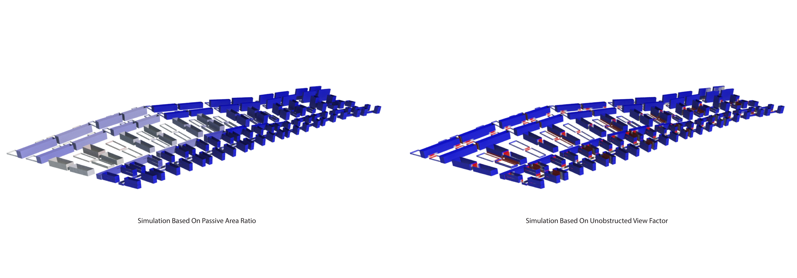
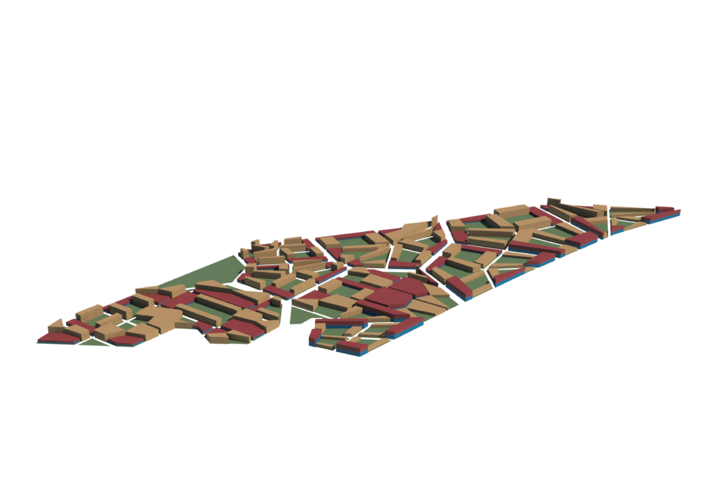
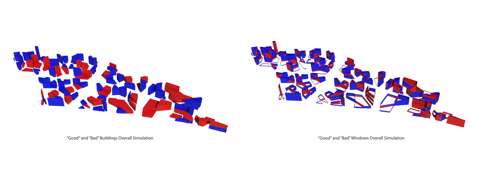

# Iteration 1
Iterations 01/A-C features simulations based on one block typology situated in the three road networks described in the introduction of this chapter.

## 01 / A

Iteration 01/A features the first block typology where the upper one-third of the plot is allocated for shops on ground level, offices above it, and two smaller residential blocks 3-6m away from the commercial block with an ample amount of courtyard space in the middle of the three blocks. Situated in the control grid road network, commercial blocks will be clustered towards the AYE to act as a noise buffer for the residential blocks, which will be clustered towards the MRT nodes.

Maximum floor count = 25
Average floor count = 5
Total number of buildings = 311

Number/percentage of good buildings = 203, 65.3%
Percentage of good windows = 81.0%

Percentage of window area that satisfies passive area ratio requirements = 95.5%
Percentage of window area that satisfies unobstructed view factor requirements = 81.3%

Percentage of window area that satisfies daylight factor requirements = 80.5%
Percentage of window area that satisfies solar factor requirements = 68.2%
## 01 / B

Maximum floor count = 11
Average floor count = 3
Total number of buildings = 220

Number/percentage of good buildings = 107, 48.6%
Percentage of good windows = 52.0%

Percentage of window area that satisfies passive area ratio requirements = 68.0%
Percentage of window area that satisfies unobstructed view factor requirements = 66.5%

Percentage of window area that satisfies daylight factor requirements = 85.7%
Percentage of window area that satisfies solar factor requirements = 64.4%
## 01 / C

Maximum floor count = 47
Average floor count = 10
Total number of buildings = 1183

Number/percentage of good buildings = 102, 55.7%
Percentage of good windows = 52.0%

Percentage of window area that satisfies passive area ratio requirements = 68.7%
Percentage of window area that satisfies unobstructed view factor requirements = 81.3%

Percentage of window area that satisfies daylight factor requirements = 76.3%
Percentage of window area that satisfies solar factor requirements = 73.7%
## Evaluation
Of the three iterations above, the grid control system 01/A achieved the most number of good buildings and windows overall. Of the two other road networks, the mixed system of parallel and irregular roads 01/C fared better in terms of the percentage of windows with unobstructed views, passive area ratio and solar factor.

