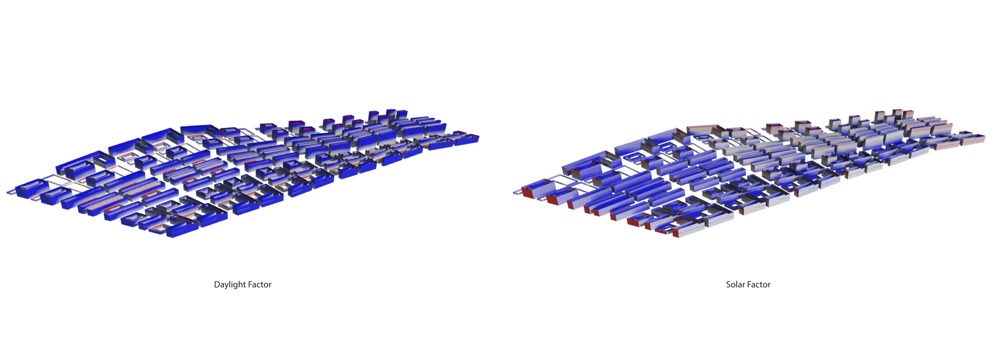
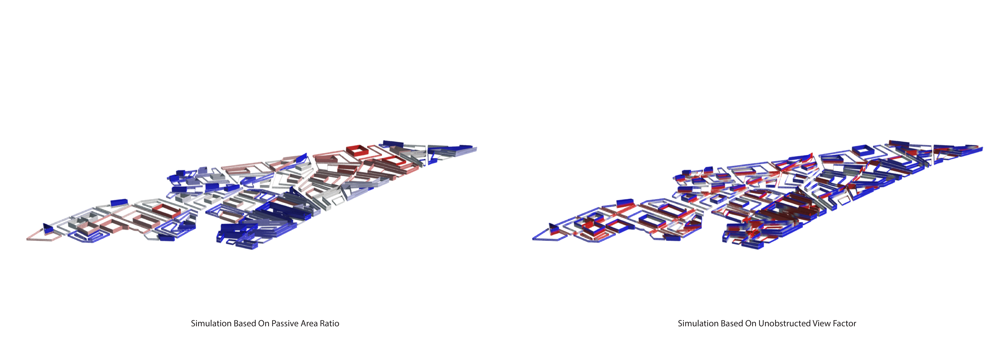
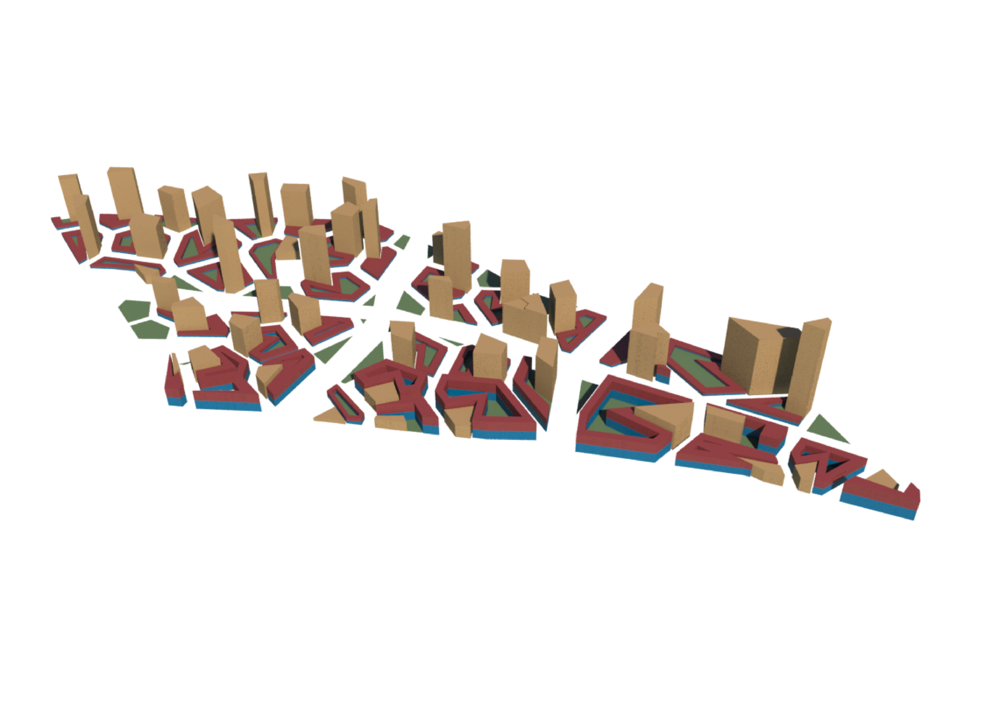
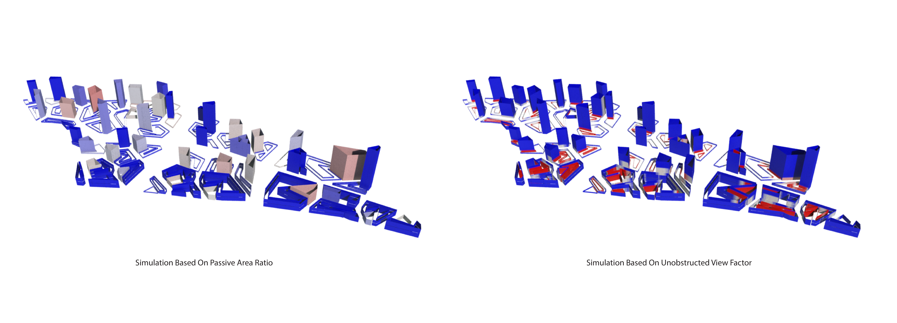
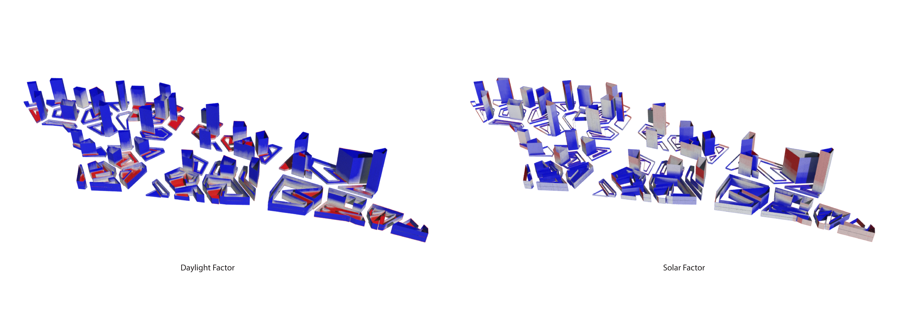

# Iteration 2
Iterations 02/A-C, similar to Iteration 1, features simulations based on one block typology situated in the three road networks described in the introduction of this chapter.
## 02 / A

Iteration 02/A features the second block typology where the shops and offices occupy three-quarters of the area, much larger than the first typology to reduce obstructions for the residential towers, with added courtyards to improve passive area ratio for the larger commercial blocks. Density does not change in this iteration - i.e. commercial blocks cluster towards the AYE while residential blocks towards the MRT nodes.

* Maximum floor count = 26
* Average floor count = 6
* Total number of buildings = 328

* Number/percentage of good buildings = 148, 45.1%
* Percentage of good windows = 69.1%

* Percentage of window area that satisfies passive area ratio requirements = 96.4%
* Percentage of window area that satisfies unobstructed view factor requirements = 47.8%

* Percentage of window area that satisfies daylight factor requirements = 54.4%
* Percentage of window area that satisfies solar factor requirements = 85.2%
## 02 / B

* Maximum floor count = 8
* Average floor count = 3
* Total number of buildings = 169

* Number/percentage of good buildings = 54, 32%
* Percentage of good windows = 32.7%

* Percentage of window area that satisfies passive area ratio requirements = 57.3%
* Percentage of window area that satisfies unobstructed view factor requirements = 52.7%

* Percentage of window area that satisfies daylight factor requirements = 79.6%
* Percentage of window area that satisfies solar factor requirements = 69.2%
## 02 / C

* Maximum floor count = 72
* Average floor count = 12
* Total number of buildings = 138

* Number/percentage of good buildings = 91, 65.9%
* Percentage of good windows = 77.8%

* Percentage of window area that satisfies passive area ratio requirements = 77.7%
* Percentage of window area that satisfies unobstructed view factor requirements = 73.6%

* Percentage of window area that satisfies daylight factor requirements = 73.8%
* Percentage of window area that satisfies solar factor requirements = 75.3%
## Evaluation
Of the three iterations, 02/C proved to have the most number of good buildings and windows, better than the control network 02/A. However, 02/A had the highest passive area ratio and best solar factor while 02/B had the highest daylight factor.

Comparing between 01/C and 02/C, the latter has a higher number of good buildings but smaller number of good windows. With less but taller buildings, 02/C achieved better passive area ratio and solar factor. Daylight factor reduced by 2.5%.

