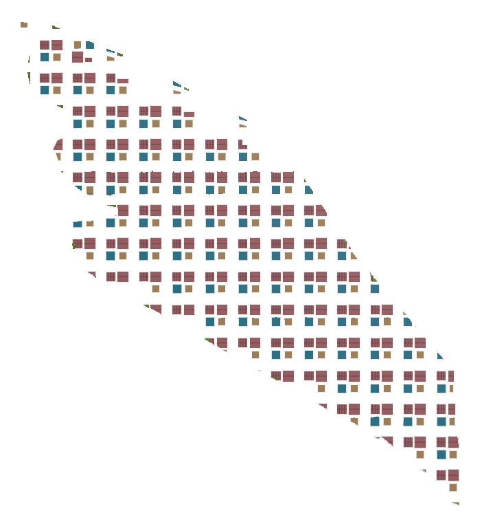

# Introduction

This chapter will be focusing on using Houdini to understand the effects of greens typology on the urban environment. This is pertaining to popular belief that the addition of greens will have some form of positive effect on the built environment. The 3 iterations will show 3 types of greens: the leftover spaces that are "green", greens on every plot and finally a central green in the middle of the development. A final iteration will be of a greater urban grid to test the widely believed positive typology of courtyard green with a central park green.

## Iteration 1: Leftover Greens 

Using a formal road grid system, the built-up area is maximized with no intention of planting greens. The greens appear in the form of leftover spaces of odd shapes and areas lesser than 130m^2. 

## Iteration 2: Greens for Everyone 

### next heading

__hi__
*hi*

* adfadf
  *dffsf

