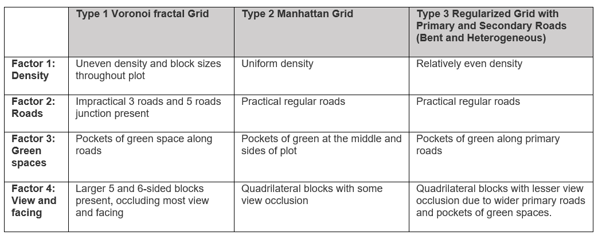

# 3.Iteration 1: Voronoi Fractured Grid

This iteration features simulation based on one block typology tested on Type 1 Voronoi fracture grid as described in the introduction of the chapter. Iteration 1 features the first block typology where the residential tower sits on the commercial podium block. The roof of the commercial and residential are sky gardens, and there is a central courtyard in the residential tower for increased ventilation and inner courtyard views.

Figure 6. Block typology and Urban morphology for Iteration 1

## 3.1.	Set-up
### 3.1.1.	The distribution of residential and commercial area is as follows
* Residential: 22sqm per person
* Commercial: 13sqm per person 
## 3.1.2.	Parameters for urban morphology
* Residential storey height: 3m
* Commercial storey height: 5m
* Green connector road 15m 
* Green buffer 5m (each side)
* Roads 8m
* Pedestrian roads 1.5m
* Parks < 600sqm
## 3.1.3.	Urban morphology
* Maximum floor count: 29
* Average floor count: 5
* Total number of buildings: 147

## 3.2.	Building Simulation

Figure 7. Iteration 1 Building simulations

### 3.2.1.	Good Building = 91.64%
* Daylight factor = 65.74%
* Passive ratio = 96.15%
* Solar Factor = 83.19% 

### 3.2.2.	Good Window =36.86%
* View Factor = 60.97%
* Good window ratio = 92.56%

## 3.3.	Evaluation
While this iteration proved a high number of good buildings, this iteration has a high number of bad windows. This is due to the way the grid had been laid out, with irregular 4 to 6-sided polygon blocks with windows facing closely to adjacent blocks. This in turn also affects the view factor, giving it xxx.
From an Urban morphology point of view, the irregular 4 to 6-sided polygon blocks are less desirable for land developers to purchase and build. Also, it leads to impractical road situations with junctions of 3 and 5 roads.
In the next iteration, the plot will be divided more regularly with the Manhattan grid so as to improve view factors and hence more good window.

## 2.3.	Plot Distribution

Figure 4.Plot distribution options

Various organisational methods and road widths were considered when dividing the plot. We came out with 3 types of grid distribution and gave them an evaluation in terms of its density, road organisation, avaliability of green spaces and its implications on view and facings. This is to understand the benefits of each apportionment method and bring its lessons forward to a scheme that is “bent and heterogeneous”.

Figure 5.Comparison of plot distribution types

## 2.4.	Standards for simulations

Subsequent simulations will be based on the following standards

For good windows, 
* view_threshold>0.4 
* daylight_threshold>0.1 
* solar_threshold<0.2 

For good building thresholds, 
* passive_threshold>0.5 
* good_window_threshold>0.1
