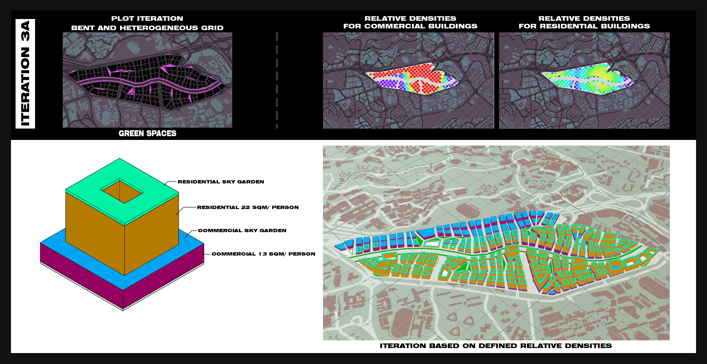

# Iteration 3 Regularized Grid with Primary and Secondary Roads (Bent and Heterogeneous)

## Iteration A
This iteration features simulation based on the same block typology tested on Type 3 Regularized grid with primary and secondary roads, as described in the introduction of the chapter. Iteration 3A features the same typology where the residential tower sits on the commercial podium block.

Figure 10. Block typology and Urban morphology for Iteration 3a

### Set-up
#### The distribution of residential and commercial area is as follows
* Residential: 22sqm per person
* Commercial: 13sqm per person 
#### Parameters for urban morphology
* Residential storey height: 3m
* Commercial storey height: 5m
* Green connector road 15m
* Green buffer 5m (each side)
* Primary roads 8m
* Secondary roads
* Pedestrian roads 1.5m
* Parks < 500sqm
#### Urban morphology
* Maximum floor count: 20
* Average floor count: 7
* Total number of buildings: 166

### Building Simulation

Figure 11. Iteration 3a Building simulations

#### Good Building = 63.23%
* Daylight factor = 43.54%
* Passive ratio = 98.86%
* Solar Factor = 88.99% 

#### Good Window =19.74%
* View Factor = 37.76%
* Good window ratio = 63.83%

### Evaluation
Comparing with Iteration 2, the current iteration resulted in significantly more good buildings. Solar factor, good window and view factor have improved over the formal iteration. However, as seen from the good window and view factor simulations, a significant number of buildings are still not ideal.
To improve upon the current iteration, the depth and width of the residential block is reduced, such that the towers can gain better view factor from its gain in height.
